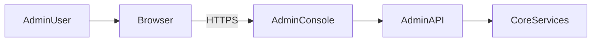

<div class='grid cards' markdown>

-   :material-dashboard:{ .lg .middle } **Admin Console**

    ---

    Single-pane management for all platform features, accessible and dyslexia-friendly

-   :material-plugin:{ .lg .middle } **Plugin Marketplace**

    ---

    Browse, install, and configure plugins from the console

-   :material-settings:{ .lg .middle } **Configuration Center**

    ---

    Manage environment variables, retention policies, and system settings

</div>

!!! tip 'User Experience'
    The Admin Console uses readable fonts, high-contrast themes, and keyboard-first navigation for better usability.

!!! note 'Admin-first requirement'
    Everything available via CLI must have an equivalent or better experience in the Admin Console.

!!! warning 'Permissions'
    Admin Console actions are controlled by RBAC. Users without sufficient roles will not see certain actions.

## Key screens

| Screen | Purpose | Access |
|--------|---------|--------|
| Dashboard | Health, metrics, quick actions | admin |
| Plugins | Marketplace & registrations | admin |
| Storage Browser | Browse classified objects | admin/storage |
| Policy Inspector | Review routing and filter rules | admin/policy |

<div class='grid cards' markdown>

-   :material-search:{ .lg .middle } **Search & Filter**

    ---

    Global search across users, plugins, and audit logs

-   :material-visibility:{ .lg .middle } **Audit Explorer**

    ---

    View and export audit trails for compliance

</div>

### Keyboard shortcuts

- ++ctrl+k++ — open command palette
- ++ctrl+f++ — focus search
- ++esc++ — close modals

### Building Admin UI locally

=== "Node.js"
    ```bash
    # Build the Admin UI locally
    cd core/admin_ui
    npm ci
    npm run build
    # Build artifacts will be in core/admin_ui/build/
    ```

=== "Make"
    ```bash
    # Using the Makefile (recommended)
    make ui-ci-local
    # This builds both core/ui and core/admin_ui
    ```

=== "Docker"
    ```bash
    # Build with Docker
    docker build -f core/admin_ui/Dockerfile -t vivified-admin-ui .
    ```

The Admin Console is packaged as a Single Page Application (SPA) and served under `/admin/ui`. In production, ensure UI build artifacts are available by running the build process during deployment.



## Settings and configuration

| Setting | Purpose | Where to edit | Notes |
|---------|---------|---------------|-------|
| THEME | UI theme (default/high contrast) | Settings > Appearance | Visual preference |
| RETENTION_YEARS | Default PHI retention | Settings > Storage | Overrides per plugin allowed |
| PLUGIN_APPROVAL | Require approval for plugin install | Settings > Plugins | Recommended for prod |

!!! note 'Audit for UI actions'
    Every UI change emits an audit event (actor, action, target). Use Audit Explorer to trace actions.

??? note 'Advanced: embedding widgets'
    Plugins can register Admin UI widgets via the manifest and a JS entrypoint. Follow the UI component style guide in core/ui.
