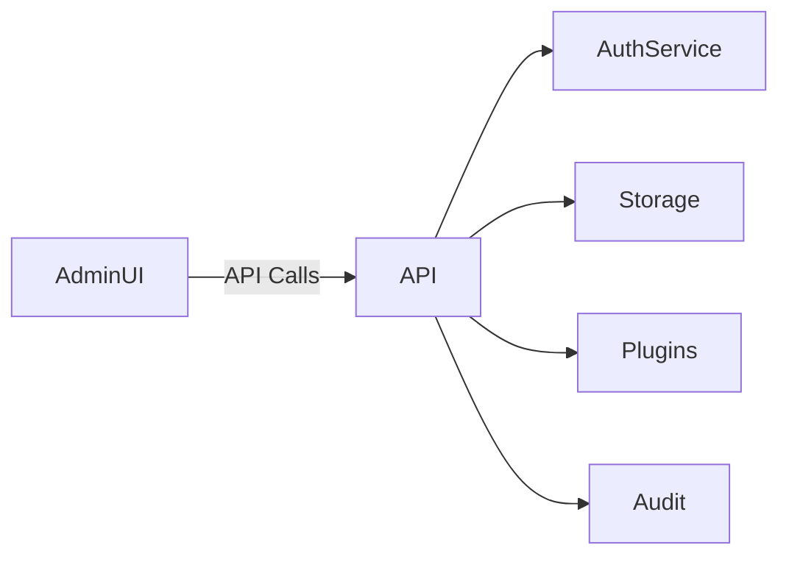

<div class='grid cards' markdown>

-   :material-api:{ .lg .middle } **Admin API**

    ---

    Role-based endpoints for system management and plugin operations

-   :material-account-box:{ .lg .middle } **User & Role Management**

    ---

    CRUD for users, roles, and assignments

-   :material-cloud-upload:{ .lg .middle } **Plugin & Config API**

    ---

    Register plugins, query audits, and manage configuration via API

</div>

!!! tip 'Use role-scoped tokens'
    Create service tokens with minimal scopes for automation and integrations.

!!! note 'Rate limits'
    Admin API enforces per-client rate-limits managed via the gateway configuration.

!!! warning 'Audit queries may be large'
    Use pagination and filters when querying audit logs to avoid long-running requests.

## Common endpoints

| Endpoint | Purpose | Method | Auth |
|----------|---------|--------|------|
| /api/users | Manage users | GET/POST/PUT/DELETE | admin |
| /api/plugins | Register/list plugins | GET/POST | admin |
| /api/config | Read/update config | GET/PUT | admin |
| /api/audit | Query audit logs | GET | admin/audit |

### Example: Create a user

=== "Python"
    ```python
    # (1)
    import requests
    token = 'Bearer <ADMIN_TOKEN>'
    r = requests.post('https://admin.example/api/users', headers={'Authorization': token}, json={'username':'alice'})
    print(r.json())
    ```

=== "Node.js"
    ```javascript
    // (1)
    const fetch = require('node-fetch')
    const res = await fetch('https://admin.example/api/users', { method: 'POST', headers: { Authorization: 'Bearer <ADMIN_TOKEN>', 'Content-Type': 'application/json' }, body: JSON.stringify({ username: 'alice' }) })
    console.log(await res.json())
    ```

=== "curl"
    ```bash
    # (1)
    curl -X POST https://admin.example/api/users -H 'Authorization: Bearer <ADMIN_TOKEN>' -H 'Content-Type: application/json' -d '{"username":"alice"}'
    ```

1. Use scoped tokens and role assertions; avoid admin tokens in automation when possible



## Audit API: filtering

| Filter | Description | Example |
|--------|-------------|---------|
| actor | Who performed action | actor=system or user id |
| action | Action type | create,user.update |
| since | ISO datetime | 2024-01-01T00:00:00Z |

!!! note 'Pagination'
    The Admin API uses cursor-based pagination for large datasets. Check response for ++next_cursor++ field.

??? note 'Advanced: webhook integrations'
    The Admin API supports webhook delivery for events. Use signed payloads and retry policies.

[^1]: API access is audited and role-checked. Ensure service accounts are limited in scope and rotated regularly.
