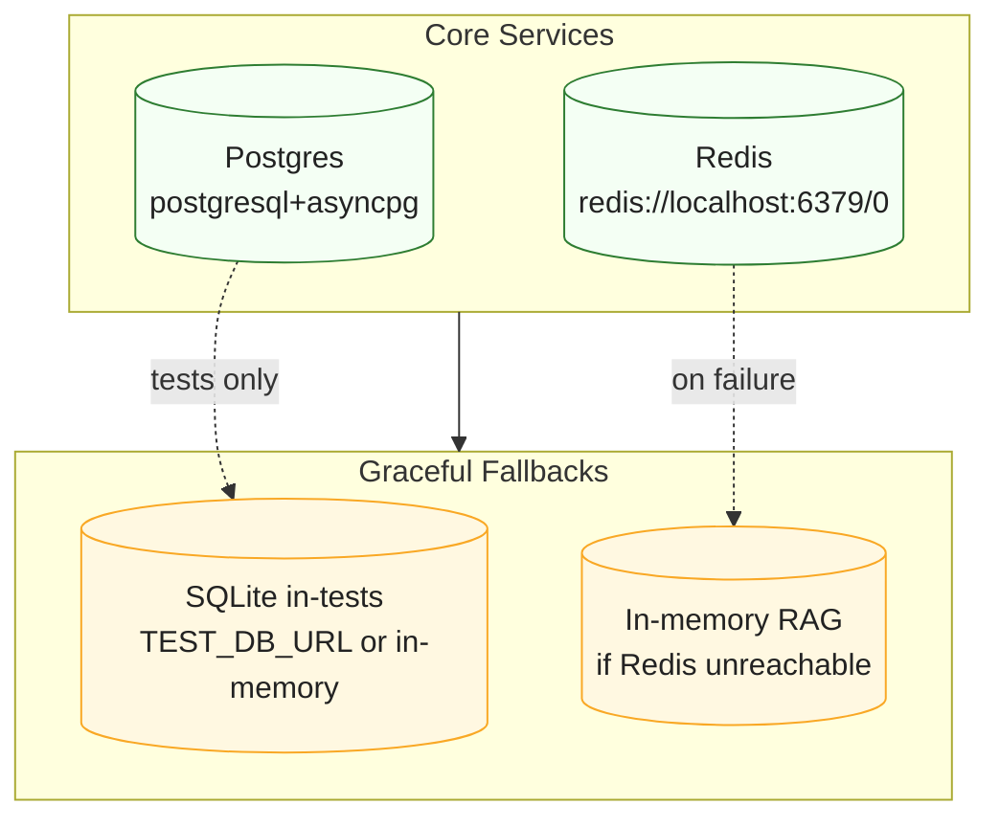

# Architecture Diagrams

System architecture diagrams and flow charts. See also: [Three-Lane Model](../core/three-lanes.md).

## Three-Lane Overview

```mermaid
flowchart TB
  %% Three-Lane overview with wrapped labels
  classDef box fill:#eef5ff,stroke:#4c6ef5,color:#222,stroke-width:1px

  subgraph Plugin[Plugin Container\n(no outbound network)]
    P1["LLM Plugin\nclassify=PHI\ntrace_id=...\nrefs not raw PHI"]:::box
  end

  CoreGW["Core Gateway\n(Operator RPC)"]:::box
  Canonical["Canonical Engine\n(schema + policy + audit)"]:::box
  Proxy["Core Proxy\n(allowlist + TLS + secrets)"]:::box
  Vectorizer["Vectorizer Plugin\n(Embed op)"]:::box

  P1 -- "Operator: Embed" --> CoreGW
  CoreGW -- "dispatch" --> Vectorizer
  P1 -- "Canonical: DocumentSummarized" --> Canonical
  P1 -- "Proxy: chat completions" --> Proxy

  class P1,CoreGW,Canonical,Proxy,Vectorizer box
```

## Defaults and Fallbacks


