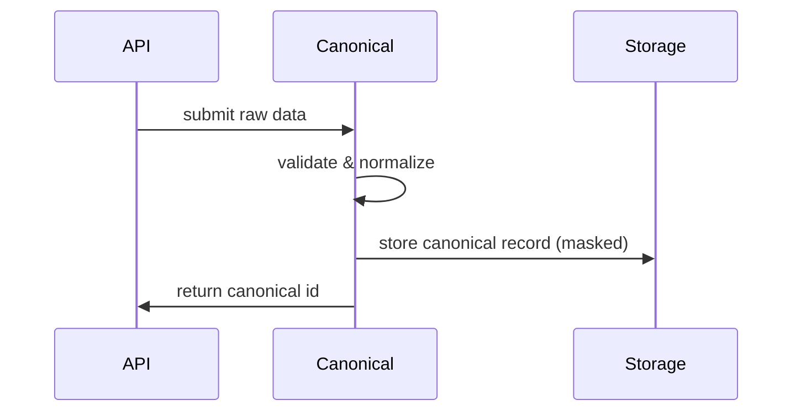

<div class='grid cards' markdown>

-   :material-format-list-bulleted:{ .lg .middle } **Canonical Service**

    ---

    Data normalization, PHI/PII transformations, audit logging

-   :material-sync:{ .lg .middle } **Cross-plugin Compatibility**

    ---

    Canonical schemas ensure plugins interoperate reliably

-   :material-audit:{ .lg .middle } **Audit-First**

    ---

    All transformations are recorded with context for compliance

</div>

!!! tip 'Use canonical types'
    When writing plugins, accept and emit canonical models so downstream services can process without custom mappings.

!!! note 'CanonicalUser & CanonicalMessage'
    Canonical models (examples) are the recommended interchange format across plugins.

!!! warning 'PII handling'
    Avoid exposing raw PHI in logs. Use canonical transformations to mask or tokenize sensitive fields.

## CanonicalUser model (excerpt)

```python
from pydantic import BaseModel, Field
from typing import List, Dict
from datetime import datetime

class CanonicalUser(BaseModel):
    id: str
    username: str
    email: str
    roles: List[str] = Field(default_factory=list)
    traits: List[str] = Field(default_factory=list)
    created_at: datetime
    attributes: Dict[str, str] = Field(default_factory=dict)

    class Config:
        use_enum_values = True
```

1. The model preserves roles and traits
2. Default factories avoid mutable default pitfalls
3. Use Pydantic for validation and JSON encoding

## CanonicalMessage model (excerpt)

```python
from pydantic import BaseModel, Field
from datetime import datetime
from uuid import uuid4
from typing import List, Dict, Any

class CanonicalMessage(BaseModel):
    id: str = Field(default_factory=lambda: str(uuid4()))
    from_user: str
    to_user: str
    content_type: str = "text/plain"
    content: bytes
    data_traits: List[str] = Field(default_factory=list)
    sent_at: datetime = Field(default_factory=datetime.utcnow)
    metadata: Dict[str, Any] = Field(default_factory=dict)
```

=== "Python"
    ```python
    # (1)
    # Example: normalize an incoming user dict to CanonicalUser
    def to_canonical_user(raw: dict) -> CanonicalUser:
        return CanonicalUser(
            id=raw.get('id'),
            username=raw['username'],
            email=raw.get('email',''),
            created_at=raw.get('created_at')
        )
    ```

=== "Node.js"
    ```javascript
    // (1)
    // Example: perform a lightweight mapping in JS before sending to API
    function toCanonicalUser(raw) {
      return {
        id: raw.id,
        username: raw.username,
        email: raw.email || '',
        roles: raw.roles || []
      }
    }
    ```

=== "curl"
    ```bash
    # (1)
    curl -X POST https://admin.example/api/canonical/users -H 'Content-Type: application/json' -d '{"username":"alice"}'
    ```

1. Transform raw inputs into canonical types before persisting or emitting

## Configuration options (canonical)

| Option | Description | Default | Enforced |
|--------|-------------|---------|---------|
| normalization.mode | Mode of normalization (strict/lenient) | strict | Recommended |
| audit.enabled | Record transform audit logs | true | Required |
| pii.masking | Mask strategy for PHI fields | tokenization | Required |



!!! danger 'Data loss risk'
    Changing canonical schemas is backwards-incompatible. Use versioned schemas and migration tooling.

??? note 'Advanced: Traits and Metadata'
    Traits are lightweight tags used for routing and filtering in messaging and storage. See the messaging docs for trait-based routing examples.

[^1]: Canonical schemas are the contract between plugins and core services.
