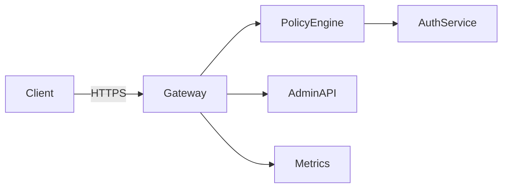

<div class='grid cards' markdown>

-   :material-gateway:{ .lg .middle } **External Gateway**

    ---

    API proxy with validation, rate-limiting, and domain allowlists

-   :material-security:{ .lg .middle } **Policy Enforcement**

    ---

    Request/response transformation and security validation for incoming traffic

-   :material-monitor:{ .lg .middle } **Monitoring**

    ---

    Rate limits, metrics, and per-client quotas

</div>

!!! tip 'Whitelist domains'
    Use domain allowlists for upstream proxies and strict validation for inbound requests.

!!! note 'Transformation'
    The gateway can mutate requests/responses to canonical formats or mask PHI for certain clients.

!!! warning 'DoS protection'
    Configure rate-limits to prevent abusive clients from overwhelming core services.

## Gateway responsibilities

| Responsibility | Description | Default |
|----------------|-------------|---------|
| Proxying | Forward external API calls to Admin API | enabled |
| Validation | Schema + security checks | enabled |
| Rate limiting | Per-client quotas and global caps | configurable |
| Filtering | Blocklist/allowlist domains & paths | configurable |



### Example: proxying & validation

=== "Python"
    ```python
    # (1)
    def proxy_request(req):
        # validate headers and body
        if not valid(req):
            raise ValueError('Invalid request')
        transformed = transform_to_canonical(req.json())
        return forward_to_api(transformed)
    ```

=== "Node.js"
    ```javascript
    // (1)
    app.post('/proxy', validateMiddleware, async (req, res) => {
      const payload = transformToCanonical(req.body)
      const r = await fetch('https://admin.example/api', { method: 'POST', body: JSON.stringify(payload) })
      res.status(r.status).send(await r.text())
    })
    ```

=== "curl"
    ```bash
    # (1)
    curl -X POST https://gateway.example/proxy -H 'Authorization: Bearer <token>' -d '{"username":"alice"}'
    ```

1. Validate early, transform, and forward to Admin API; keep gateways stateless where possible

## Configuration (gateway)

| Key | Purpose | Example | Required |
|-----|---------|---------|----------|
| GATEWAY_RATE_LIMIT | Rate limit per client | 100/min | yes |
| GATEWAY_ALLOWLIST | Allowed upstream domains | api.example.com | recommended |
| GATEWAY_AUTH_TYPE | Auth mechanism (jwt/mTLS) | jwt | yes |

!!! danger 'Exposing PHI'
    Do not log full request/response bodies that may contain PHI. Use truncation or structured masks in logs.

??? note 'Advanced: policy engine'
    The gateway integrates with a policy engine to apply RBAC and attribute-based rules before forwarding.

[^1]: Gateway configuration should be centrally managed and deployed consistently across environments.
