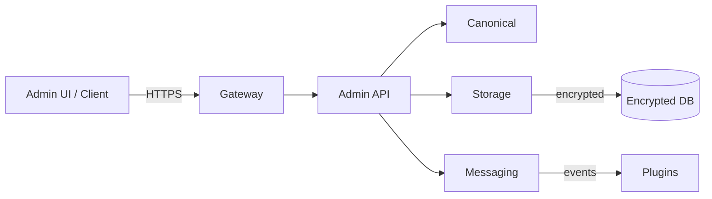

-   :material-shield-check:{ .lg .middle } **Core Services**

    ---

    Canonical, Storage, Messaging, API, Gateway — secure, modular services

-   :material-format-list-bulleted:{ .lg .middle } **Service Catalog**

    ---

    Service contract and integrations for plugins and Admin API

-   :material-security:{ .lg .middle } **Compliance Built-in**

    ---

    Encryption, audit logs, retention policies aligned to HIPAA

!!! tip 'Readability'
    Each core service is documented separately (canonical, storage, messaging, gateway). Use this index as the quick map.

!!! note 'User-facing focus'
    The docs below describe how to operate, configure, and integrate with core services — not internal roadmap.

!!! warning 'Audit trails'
    All PHI/PII-affecting operations are audit-logged. Ensure your integration preserves audit context.

## Core Services Overview

| Service | Primary Function | Status | HIPAA |
|---------|------------------|--------|-------|
| canonical | Data normalization & transformation | ✅ Active | Compliant |
| storage | Encrypted PHI/PII storage | ✅ Active | Compliant |
| messaging | Event bus & inter-plugin comms | ✅ Active | Compliant |
| api | Admin API (role-based) | ✅ Active | Compliant |
| gateway | External proxy & validation | ✅ Active | Compliant |

### Architecture

??? note 'Service contracts'
    Each core service exposes stable REST/gRPC or async interfaces documented in the service subpages.

## Links

- core/canonical.md — Canonical data models and normalization
- core/storage.md — Encrypted storage and retention
- core/messaging.md — Event bus and message flows
- core/gateway.md — External API gateway and filtering

[^1]: Core services are the user-facing integration points for plugins and admin operations.
