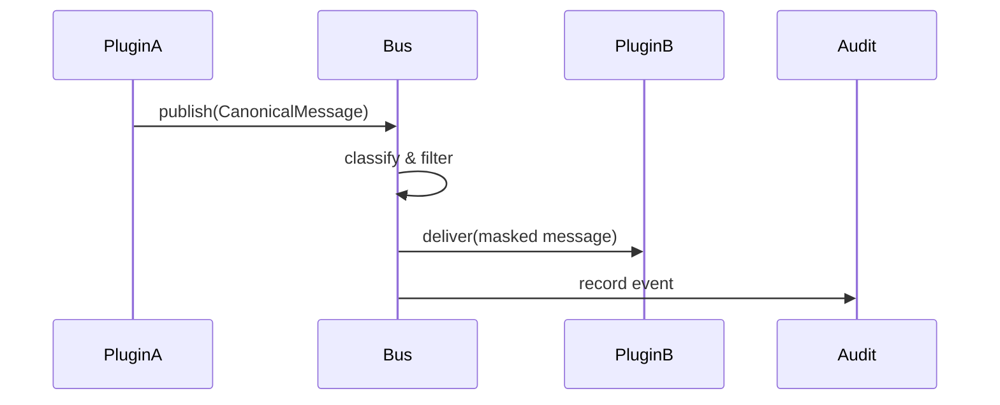

<div class='grid cards' markdown>

-   :material-forum:{ .lg .middle } **Messaging (Event Bus)**

    ---

    HIPAA-aware event bus for inter-plugin communication with routing and filtering

-   :material-filter:{ .lg .middle } **Routing & Filtering**

    ---

    Trait-based routing and message-level policy enforcement

-   :material-history:{ .lg .middle } **Audit & Replay**

    ---

    Immutable event logs with replay capabilities for recovery and audit

</div>

!!! tip 'Design for idempotency'
    Handlers must be idempotent: messages may be retried and delivered more than once.

!!! note 'PHI protection'
    The messaging layer enforces encryption and masking of PHI fields before delivery to non-authorized listeners.

!!! warning 'Message size'
    Large payloads should be stored in storage and a pointer delivered in the message to avoid exceeding bus limits.

## Core features

| Feature | Description | Status | HIPAA |
|---------|-------------|--------|-------|
| Routing | Trait-based routing | ✅ Active | Compliant |
| Encryption | Message-level encryption | ✅ Active | Compliant |
| Audit | Full message audit trail | ✅ Active | Compliant |
| Filtering | Policy-based filtering | ✅ Active | Compliant |

### Message flow



### Example: publish a canonical message

=== "Python"
    ```python
    # (1)
    async def publish_message(bus_client, msg: CanonicalMessage):
        await bus_client.publish('messages', msg.dict())
    ```

=== "Node.js"
    ```javascript
    // (1)
    await busClient.publish('messages', canonicalMessage)
    ```

=== "curl"
    ```bash
    # (1)
    curl -X POST https://admin.example/api/messaging/publish -H 'Content-Type: application/json' -d '{"to_user":"bob"}'
    ```

1. Use the messaging client to publish; the bus enforces classification and audit

## Configuration (messaging)

| Option | Purpose | Default | Required |
|--------|---------|---------|----------|
| BUS_BACKEND | Messaging backend (kafka/rabbit) | kafka | yes |
| ENCRYPTION | Enable message encryption | true | yes |
| RETENTION_DAYS | Message retention on bus | 30 | recommended |

!!! note 'Replay and recovery'
    The bus stores immutable events and supports replay to rebuild derived state. Use replay carefully with rate-limiting.

??? note 'Advanced routing'
    Traits are referenced in canonical messages to enable fine-grained routing rules. See policy engine docs in gateway for examples.

[^1]: Messaging events are audited; use tokens and roles to control who can subscribe to PHI-bearing topics.
