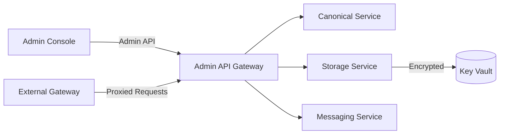

<div class='grid cards' markdown>

-   :material-shield-check:{ .lg .middle } **Core Services**
    
    ---
    Canonical, Storage, Messaging, Gateway — secure and modular

-   :material-puzzle:{ .lg .middle } **Modular Design**
    
    ---
    Plugin-first architecture with well-defined contracts

-   :material-insights:{ .lg .middle } **Observability**
    
    ---
    Audit logs, metrics, and health endpoints across services

</div>

!!! tip "Admin-First Design"
    All core service operations must be available through the Admin Console. No CLI-only controls.

!!! note "PHI/PII Handling"
    Core services are built to minimize PHI exposure. Use classification and redaction in storage and messages.

!!! warning "Network Exposure"
    Do not expose internal core endpoints directly to the public internet. Use the Gateway for external access.

## Services at a Glance

| Service | Purpose | Exposed Interfaces | HIPAA |
|---------|---------|--------------------|-------|
| canonical | Normalize and transform data | gRPC/REST, plugins | Compliant |
| storage | Encrypted PHI/PII storage | REST API, SDK | Compliant |
| messaging | Inter-plugin event bus | Pub/Sub API | Compliant |
| gateway | External proxy & filtering | HTTP(S) ingress | Compliant |


<div class='grid cards' markdown>

-   :material-code-tags-check:{ .lg .middle } **Stable SDKs**
    
    ---
    Python and Node.js SDKs for service access

-   :material-security:{ .lg .middle } **Audit & Retention**
    
    ---
    7-year retention for audit logs, tamper-proof append-only store

</div>

## High-level Architecture




## Getting Service Status

=== "Python"
    ```python
    # (1) Simple health check against Admin API
    import requests
    r = requests.get('https://localhost:8443/health')
    print(r.json())
    ```

=== "Node.js"
    ```javascript
    // (1) Node health check
    const fetch = require('node-fetch')
    fetch('https://localhost:8443/health').then(r => r.json()).then(console.log)
    ```

=== "curl"
    ```bash
    # (1) Use curl to check overall platform health
    curl -sS https://localhost:8443/health | jq
    ```

1. Requests the unified health endpoint which aggregates service health


## Service Contracts (short)

- Canonical: accepts plugin-specific payloads, returns normalized canonical model
- Storage: uses AES-256 at rest, per-tenant keying supported
- Messaging: event bus supports routing, filters, and PII-safe payloads
- Gateway: domain allowlists, request/response transformations


### Glossary

CanonicalUser
:   Standard user model across plugins

Audit Log
:   Immutable, append-only record of data and operational events


## Operational Checklist

- [x] Ensure audit.retention_years >= 7
- [x] Verify encryption keys stored in Key Vault
- [ ] Regularly rotate keys and review RBAC


??? note "Debugging Tips"
    Use ++ctrl+shift+i++ to open browser devtools for Admin UI troubleshooting. Check network requests to /api/* endpoints.
