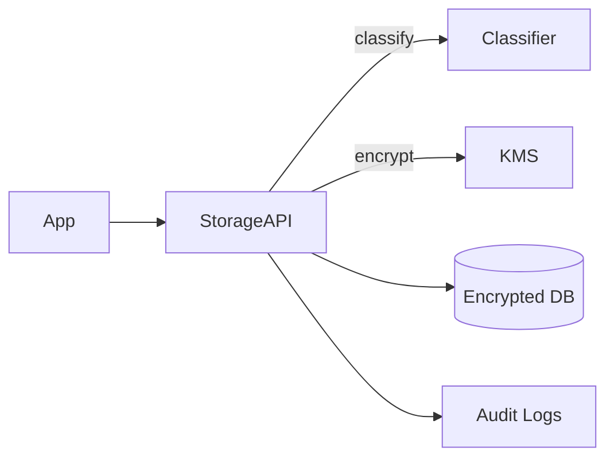

<div class='grid cards' markdown>

-   :material-database:{ .lg .middle } **Encrypted Storage**

    ---

    HIPAA-compliant storage abstraction with automatic classification and retention

-   :material-lock:{ .lg .middle } **Encryption & Keys**

    ---

    AES-256 at rest, envelope encryption, and key rotation support

-   :material-history:{ .lg .middle } **Retention & Audit**

    ---

    Policy-driven retention with 7-year audit retention

</div>

!!! tip 'Encryption'
    All PHI/PII must be encrypted at rest and in transit. Use the storage abstraction rather than writing raw blobs to your own tables.

!!! note 'Automatic Classification'
    The storage layer classifies data on ingest and applies appropriate retention/labeling.

!!! warning 'Key management'
    Rotate keys regularly and ensure that rotated keys are stored in a secure KM provider. Losing keys can cause irreversible data loss.

## Storage Capabilities

| Feature | Description | Status | HIPAA |
|---------|-------------|--------|-------|
| Encryption | AES-256 envelope encryption | ✅ Active | Compliant |
| Classification | Automatic PHI/PII labeling | ✅ Active | Compliant |
| Retention | Policy-driven retention (years) | ✅ Active | Compliant |
| Audit Logs | 7-year retention for auditable changes | ✅ Active | Compliant |

### Example: storing a canonical user

=== "Python"
    ```python
    # (1)
    # Use the storage client to store a canonical record with classification
    async def store_user(storage_client, canonical_user):
        await storage_client.put('users', canonical_user.id, canonical_user.dict())
    ```

=== "Node.js"
    ```javascript
    // (1)
    // Node example: store a user via the storage client
    await storageClient.put('users', canonicalUser.id, canonicalUser)
    ```

=== "curl"
    ```bash
    # (1)
    curl -X PUT https://admin.example/api/storage/users/alice -H 'Content-Type: application/json' -d '{"id":"alice"}'
    ```

1. Always use storage client to centralize encryption and classification



## Configuration table (storage)

| Key | Purpose | Example | Required |
|-----|---------|---------|----------|
| STORAGE_BACKEND | Storage backend type | s3 | yes |
| STORAGE_KMS_KEY | KMS key identifier | arn:aws:kms:... | yes |
| RETENTION_YEARS | Data retention policy (years) | 7 | yes |
| AUDIT_RETENTION_YEARS | Audit retention | 7 | recommended |

!!! danger 'Irrecoverable loss'
    If you delete or rotate KMS keys without backup or key escrow, data encrypted with the old key may be unrecoverable.

??? note 'Access patterns'
    For large attachments, the storage client supports streaming uploads and signed URLs to avoid loading big objects into memory.

[^1]: Storage settings must be centrally managed via Admin Console and auditable.
