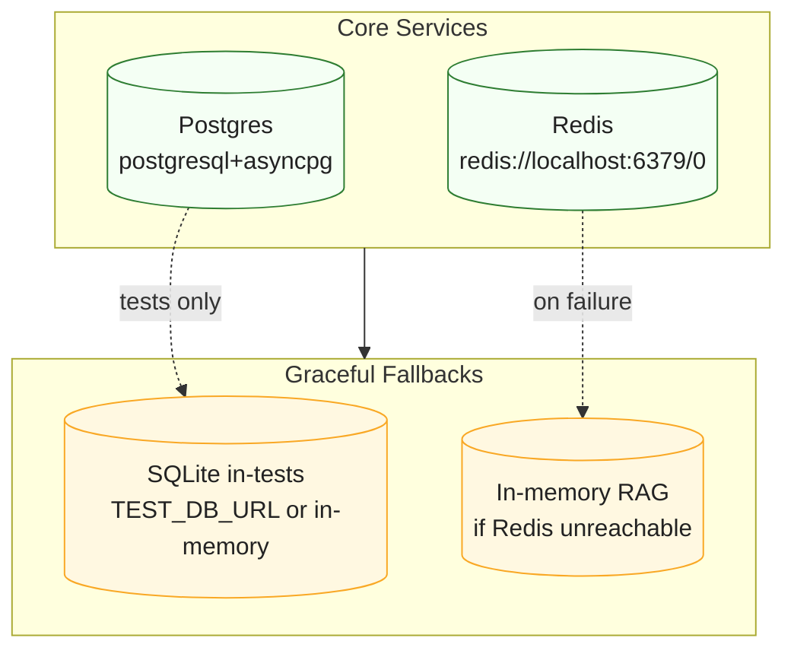

# Three-Lane Communication Model

The platform enforces three supervised lanes for all data movement: Canonical (events), Operator (internal RPC), and Proxy (egress). Plugins run in isolated containers with no direct database or network access; every lane terminates in Core, where policy, audit, redaction, rate limits, and allowlists are applied. When safety cannot be proven, the action is blocked (fail-safe).

## Actors & Guards

- Plugin runtime: isolated container, no outbound network; authenticates to Core with a unique token.
- Core Gateway: entry point for Operator calls (`/gateway/{target_plugin}/{operation}`).
- Canonical Engine: normalized event hub (`core/canonical/*`) with validation and policy.
- Proxy: the only egress path; enforces domain/path allowlists and TLS; blocks IP literals/localhost.
- Policy Engine: evaluates traits, roles, data classification, and operation allowlists.
- Audit Service: structured logs with `trace_id` and redacted PHI/PII; every decision/action recorded.
- Storage Service: AES‑256 at rest; PHI tagging and retention metadata.
- Identity: derives claims/traits for policy and trait‑gated UI.

## Why Three Lanes

- Canonical abstracts data semantics and decouples producers/consumers with strong validation and policy.
- Operator provides tightly scoped, synchronous actions without exposing network primitives.
- Proxy centralizes egress, secret handling, and compliance controls to reduce exfiltration risk.

## Visuals

```mermaid
flowchart TB
  %% Three-Lane overview with wrapped labels
  classDef box fill:#eef5ff,stroke:#4c6ef5,color:#222,stroke-width:1px
  classDef edge stroke:#888,color:#444

  subgraph Plugin[Plugin Container\n(no outbound network)]
    P1["LLM Plugin\nclassify=PHI\ntrace_id=...\nrefs not raw PHI"]:::box
  end

  CoreGW["Core Gateway\n(Operator RPC)"]:::box
  Canonical["Canonical Engine\n(schema + policy + audit)"]:::box
  Proxy["Core Proxy\n(allowlist + TLS + secrets)"]:::box
  Vectorizer["Vectorizer Plugin\n(Embed op)"]:::box

  %% Edges (use short phrases to avoid overflow)
  P1 -- "Operator: Embed" --> CoreGW
  CoreGW -- "dispatch" --> Vectorizer
  P1 -- "Canonical: DocumentSummarized" --> Canonical
  P1 -- "Proxy: chat completions" --> Proxy

  style Plugin fill:#f8fbff,stroke:#aac6ff,stroke-width:1px
  class P1,CoreGW,Canonical,Proxy,Vectorizer box
```



## Journey: A Piece of Data Inside the LLM Plugin

Imagine a PHI‑bearing text snippet the LLM plugin must summarize and then notify others.

1) Born in the LLM plugin
- The plugin tags payload `classification=["phi"]`, sets `tenant_id`, and creates a `trace_id`.
- It constructs requests carrying identity (plugin token → plugin id + traits), classification tags, policy context (actor, tenant, purpose, operation), and observability metadata (`trace_id`, `span_id`, timestamps, idempotency key).

2) Proxy Lane: call an external LLM safely
- The plugin cannot open sockets. It builds an `EgressRequest` describing target domain/path, method, and payload. No scheme, no IP literals, no localhost; no plugin-supplied Authorization.
- Core Proxy enforces allowlists, injects secrets from vault, enforces TLS 1.3+, applies rate limits, redacts and audits.

3) Canonical Lane: publish the normalized result
- The plugin wraps the result in a normalized canonical event (e.g., `DocumentSummarized`) including schema version, tenant, classification tags, references/hashes (not raw PHI).
- Canonical validates schema, enforces policy (e.g., `handles_phi`), audits, persists with encryption, and fans-out only to authorized consumers.

4) Operator Lane: invoke another plugin synchronously
- For embeddings, the LLM plugin calls `POST /gateway/vectorizer/Embed` with a compact reference or redacted text.
- Gateway authenticates, checks operation allowlist, applies SSRF guards, evaluates policy and rate limits, audits, and dispatches to the vectorizer plugin.

5) Secondary events and notifications
- Emit `DocumentEmbedded` canonical event for indexing.
- Notifications rules evaluate events and may emit a `NotificationRequest` to audiences by trait (e.g., `sales`). Any external fan‑out uses Proxy with allowlists and secret injection.

6) Admin Console visibility (trait‑aware)
- Diagnostics shows lane health and provider status.
- Audit views show lineage: Proxy call → Canonical events → Operator call. Payloads remain redacted; classification is visible; everything linked by `trace_id`.

## Example Payloads

Below are reference envelopes. Fields are indicative; adapt to your SDK structures. Avoid including raw PHI—prefer references/hashes and classification metadata.

### Proxy Lane — EgressRequest (request)

```json
{
  "trace_id": "6b3c8a10-6d3f-4f1e-9d41-9e5a7a12c0c7",
  "span_id": "08a9c3b2d8f1a7e2",
  "idempotency_key": "llm:complete:doc-9f3f:v1",
  "tenant_id": "tenant_abc",
  "actor": { "type": "plugin", "id": "plugin.llm" },
  "actor_traits": ["handles_phi", "ai_client"],
  "classification": ["phi"],
  "purpose": "clinical_summary",
  "policy_context": {
    "operation": "proxy.egress",
    "requested_scopes": ["egress:api.openai.com:/v1/chat/completions:POST"],
    "data_tags": ["phi"]
  },
  "target": {
    "domain": "api.openai.com",
    "path": "/v1/chat/completions",
    "method": "POST"
  },
  "headers": {
    "content-type": "application/json"
  },
  "body": {
    "model": "gpt-4o-mini",
    "messages": [
      { "role": "system", "content": "You are a helpful assistant." },
      { "role": "user", "content_ref": "urn:doc:9f3f#segment:summary-input" }
    ],
    "temperature": 0.2
  },
  "constraints": { "require_tls": true, "disallow_ip_literals": true }
}
```

### Proxy Lane — EgressResponse (response)

```json
{
  "trace_id": "6b3c8a10-6d3f-4f1e-9d41-9e5a7a12c0c7",
  "request_id": "req_01HZXK2FQ0R2M3WZQ8",
  "policy_decision": {
    "allowed": true,
    "rule": "allow:openai.com:completions",
    "redactions": ["headers.authorization", "body.choices[].message.content"]
  },
  "rate_limit": { "domain": "api.openai.com", "remaining": 149, "reset_ms": 42000 },
  "egress": {
    "status": 200,
    "duration_ms": 512,
    "response_headers": { "content-type": "application/json" },
    "response_body": {
      "id": "chatcmpl-abc123",
      "choices": [
        { "index": 0, "message_ref": "urn:doc:9f3f#segment:summary-output", "finish_reason": "stop" }
      ]
    }
  },
  "audit_id": "aud_01HZXK39W8HK3Z9XPK"
}
```

### Canonical Lane — Event (DocumentSummarized)

```json
{
  "trace_id": "6b3c8a10-6d3f-4f1e-9d41-9e5a7a12c0c7",
  "tenant_id": "tenant_abc",
  "producer": { "type": "plugin", "id": "plugin.llm" },
  "producer_traits": ["handles_phi"],
  "classification": ["phi"],
  "topic": "canonical.documents.summarized",
  "schema": { "name": "DocumentSummarized", "version": "1.2.0" },
  "occured_at": "2025-09-29T09:32:41.120Z",
  "data": {
    "document_ref": "urn:doc:9f3f",
    "summary_ref": "urn:doc:9f3f#segment:summary-output",
    "summary_hash": "sha256-3d9212...",
    "language": "en",
    "model": "gpt-4o-mini",
    "tokens_used": { "prompt": 1024, "completion": 128 }
  },
  "policy_context": { "operation": "canonical.emit", "data_tags": ["phi"] }
}
```

### Operator Lane — Gateway RPC (request) to Vectorizer.Embed

```json
{
  "trace_id": "6b3c8a10-6d3f-4f1e-9d41-9e5a7a12c0c7",
  "span_id": "7e2c1a0b4f9d3c8a",
  "tenant_id": "tenant_abc",
  "caller": { "type": "plugin", "id": "plugin.llm" },
  "caller_traits": ["handles_phi", "ai_client"],
  "classification": ["phi"],
  "operation": "vectorizer.Embed",
  "params": {
    "content_ref": "urn:doc:9f3f#segment:summary-output",
    "normalize": true,
    "dims": 1536
  },
  "policy_context": {
    "operation": "gateway.invoke",
    "requested_scopes": ["rpc:vectorizer.Embed"],
    "data_tags": ["phi"]
  }
}
```

### Operator Lane — Gateway RPC (response)

```json
{
  "trace_id": "6b3c8a10-6d3f-4f1e-9d41-9e5a7a12c0c7",
  "policy_decision": {
    "allowed": true,
    "rule": "allow:rpc:vectorizer.Embed",
    "redactions": []
  },
  "result": {
    "embedding_ref": "urn:vec:9f3f#v1",
    "dims": 1536,
    "vector_checksum": "sha256-91ba77...",
    "duration_ms": 34
  },
  "audit_id": "aud_01HZXK4VJCCEV5Q2V8"
}
```

## Failure Modes (blocking conditions)

- Proxy: domain not allowlisted; IP literal/localhost; non‑TLS; forbidden path; missing secrets; rate‑limit exceeded → request denied and audited.
- Canonical: schema mismatch; missing/invalid classification; producer lacks `handles_phi`; tenant/policy violation → event rejected and audited.
- Operator: operation not allowlisted; SSRF‑unsafe parameters (scheme present, non‑internal host); caller lacks traits/permissions; rate‑limit exceeded → call denied and audited.

## Practical Tips for LLM Plugin Authors

- Always tag payloads with correct classification (`phi`, `pii`, `confidential`) and `tenant_id`.
- Use Canonical for sharing results/events; minimize PHI content in events; prefer references/hashes.
- Use Operator for internal, synchronous helpers; pass references instead of raw PHI when possible.
- Use Proxy for any external API; never embed credentials or full URLs; request domains/paths that are pre‑allowlisted.
- Keep `trace_id` consistent across lanes to preserve end‑to‑end lineage.

## Admin Console Parity

- Expose `/auth/me` for trait discovery; Admin Console hides/shows features accordingly.
- Provide `/admin/ui-config` and `/admin/user/traits` for feature flags and trait mapping.
- Diagnostics: health, provider status, and lane metrics; all trait‑aware and least‑privilege by default.
