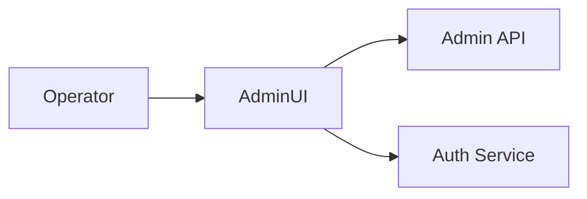

<div class='grid cards' markdown>

-   :material-dashboard:{ .lg .middle } **Admin Console**

-   :material-settings:{ .lg .middle } **Settings & Configuration**

-   :material-dashboard_customize:{ .lg .middle } **Plugin Management**

</div>

!!! tip "Accessibility"
    All features must be accessible via the Admin Console per the Accessibility/Dyslexia Mandate.

!!! note "No CLI-only Features"
    Operator actions, including plugin enablement and storage management, must be available via the UI.

!!! warning "Admin Privileges"
    Admin accounts grant wide access. Use MFA and role separation for production.

## Entry points

| Area | Path | Purpose |
|------|------|---------|
| Dashboard | /admin/ui | System overview |
| Plugins | /admin/ui/plugins | Register & manage plugins |
| Storage Browser | /admin/ui/storage | Browse encrypted objects |
| Settings | /admin/ui/settings | Global configuration |



## Common tasks

- [x] Add a plugin
- [x] Configure plugin credentials
- [x] Run smoke tests

### Adding a plugin

=== "Python"
    ```python
    # (1) Example: create plugin registration payload
    payload = {"id":"com.example.plugin","name":"Example"}
    requests.post('https://localhost:8443/api/v1/plugins/register', json=payload)
    ```

=== "Node.js"
    ```javascript
    // (1) Trigger plugin register via JS client (pseudo)
    client.plugins.register({ id: 'com.example.plugin', name: 'Example' })
    ```

=== "curl"
    ```bash
    # (1) cURL register plugin
    curl -X POST -H "Content-Type: application/json" -d '{"id":"com.example.plugin","name":"Example"}' https://localhost:8443/api/v1/plugins/register
    ```

1. Use Admin API to register plugins; the Admin Console surfaces registration in UI

??? note "Provider Setup Wizard"
    Use Provider Setup Wizard components shipped by plugins to guide operators through credential entry and initial tests.

## Storage Browser

- Browse encrypted objects
- Search by tags, traits, and time ranges

| Filter | Description | Notes |
|--------|-------------|-------|
| tag | PHI/PII / custom tags | Auto-applied by storage classifier |
| timeframe | Date range | Useful for retention checks |

!!! info "Helpful"
    Use the built-in outbound smoke tests for plugin connectivity checks.
