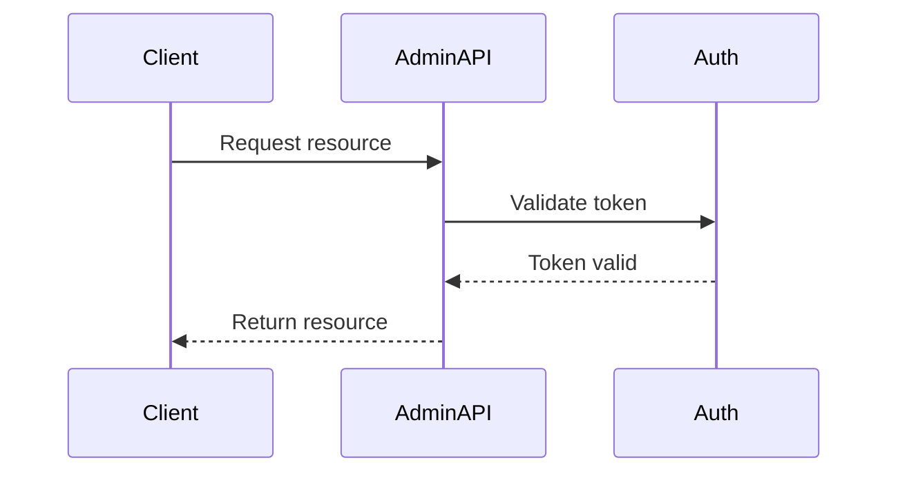

<div class='grid cards' markdown>

-   :material-api:{ .lg .middle } **Admin API**

-   :material-key:{ .lg .middle } **Authentication & RBAC**

-   :material-history-edu:{ .lg .middle } **Audit & Logs**

</div>

!!! tip "API Usage"
    Use the Admin API for all management operations. Service-to-service interactions should use scoped service tokens.

!!! note "Rate Limits"
    Admin API enforces rate limits for management endpoints. Monitor via /metrics.

!!! warning "Credentials"
    Use short-lived tokens and rotate them regularly.

## Authentication & Authorization

| Mechanism | Purpose | Recommended |
|----------|---------|-------------|
| OAuth2 / OIDC | User auth & SSO | ✅ |
| Service tokens | Service-to-service | Scoped, short-lived |
| RBAC | Role-based access | Enforce least privilege |



## Key endpoints (examples)

| Endpoint | Method | Purpose | Auth |
|----------|--------|---------|------|
| /api/v1/health | GET | Health check | None or token |
| /api/v1/plugins/register | POST | Register plugin | Admin token |
| /api/v1/storage/objects | POST | Store object | Scoped token |
| /api/v1/messaging/publish | POST | Publish message | Scoped token |

### Example: get health

=== "Python"
    ```python
    # (1) Healthcheck
    import requests
    r = requests.get('https://localhost:8443/api/v1/health')
    print(r.json())
    ```

=== "Node.js"
    ```javascript
    // (1) Healthcheck using fetch
    const res = await fetch('https://localhost:8443/api/v1/health')
    const data = await res.json()
    console.log(data)
    ```

=== "curl"
    ```bash
    # (1) cURL healthcheck
    curl -k https://localhost:8443/api/v1/health
    ```

1. Health endpoint accessible for smoke tests

??? note "Versioning"
    API is versioned under /api/v1/. Backwards-incompatible changes will be released as /api/v2/.

## Error responses

| Status | Meaning | Action |
|--------|---------|--------|
| 400 | Bad Request | Validate payload |
| 401 | Unauthorized | Refresh token |
| 403 | Forbidden | Check RBAC roles |
| 500 | Server Error | Check logs & audit |

!!! danger "Sensitive Data"
    Do not surface PHI in error messages. Errors should reference an audit ID for operator lookup.
