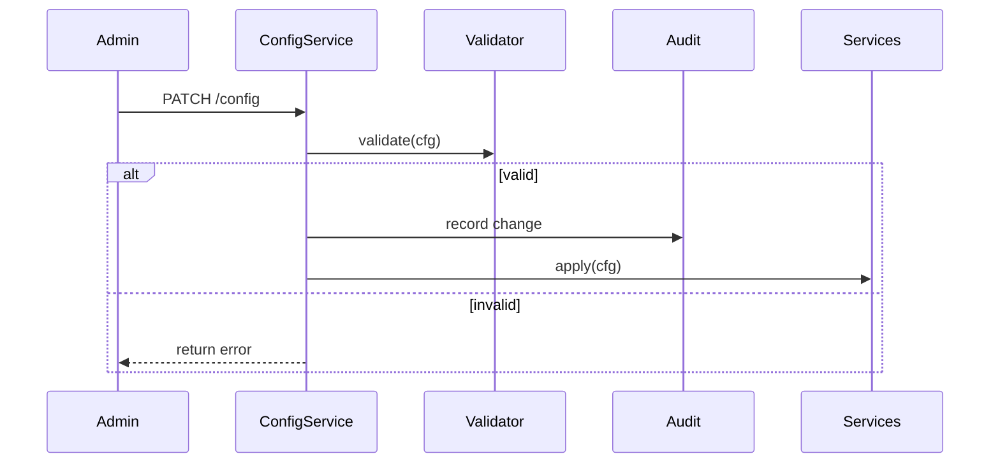

<div class='grid cards' markdown>

-   :material-settings:{ .lg .middle } **Configuration Reference**
    
    ---
    Centralized configuration exposed in Admin Console and as files

-   :material-dns:{ .lg .middle } **Environment Profiles**
    
    ---
    Default, staging, production profiles with validation

-   :material-security:{ .lg .middle } **Sensitive Settings**
    
    ---
    Keys, secrets, and retention policies

</div>

!!! tip "Manage via Admin Console"
    Prefer editing configuration via Admin Console to ensure changes are versioned and audited.

!!! note "Config Validation"
    The platform validates configuration on save; invalid configs will not be applied to services.

!!! warning "Do Not Commit Secrets"
    Avoid checking secrets or keys into git. Use Key Vault and Admin Console secret storage.

## Global Configuration Table

| Option | Path | Type | Default | HIPAA |
|--------|------|------|---------|-------|
| Encryption key | storage.encryption_key | string | generated | Compliant |
| Audit retention | audit.retention_years | int | 7 | Compliant |
| UI enable | ui.enable_admin | bool | true | N/A |


## Environment Variables (short)

| Variable | Purpose | Example |
|----------|---------|---------|
| VIVIFIED_ENV | Environment profile | production |
| DATABASE_URL | DB connection string | postgresql://... |
| KEY_VAULT_URL | Key Vault endpoint | https://vault.example.com |


## Example Configuration File

=== "Python"
    ```python
    # (1) Loading configuration example
    import yaml
    with open('config.yaml') as f:
      cfg = yaml.safe_load(f)
    print(cfg['storage']['encryption_key'])
    ```

=== "Node.js"
    ```javascript
    // (1) Read config in Node
    const fs = require('fs')
    const cfg = JSON.parse(fs.readFileSync('config.json'))
    console.log(cfg.storage.encryption_key)
    ```

=== "curl"
    ```bash
    # (1) Apply configuration via Admin API
    curl -X POST https://localhost:8443/api/v1/config -H 'Authorization: Bearer TOKEN' -H 'Content-Type: application/json' -d @config.json
    ```

1. Apply configuration through Admin API to ensure validation and audit


## Validation Rules

- Mandatory encryption key for storage
- Audit retention must be >= 7 in regulated deployments
- UI routes enabled by default


## Rollback and Versioning

- Admin Console keeps configuration versions and allows rollback
- Changes are auditable and include user id and timestamp




??? note "Advanced: Feature Flags"
    Use per-tenant feature flags for incremental rollouts. Manage flags via Admin Console feature toggle UI.

[^1]: Always keep configuration templates and examples in the repo but do NOT commit secrets.
