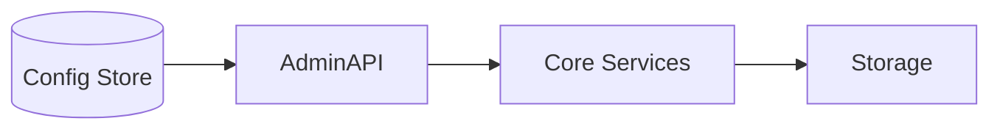

<div class='grid cards' markdown>

-   :material-settings:{ .lg .middle } **Configuration Reference**

-   :material-key:{ .lg .middle } **Secrets & Keys**

-   :material-tune:{ .lg .middle } **Tuning & Retention**

</div>

!!! note "Centralized Config"
    Use the Admin Console to manage most runtime configuration. For infra-level config use environment variables and secrets management.

!!! tip "Defaults"
    Reasonable defaults are provided but must be reviewed for compliance before production use.

!!! danger "Critical"
    Never store production secrets in plaintext or checked-in files.

## Global configuration options

| Key | Type | Default | Description |
|-----|------|---------|-------------|
| ADMIN_API_PORT | int | 8443 | Port for Admin API |
| STORAGE_KMS_KEY | string | "" | KMS key identifier for storage encryption |
| AUDIT_RETENTION_DAYS | int | 2555 | Audit retention in days (7 years) |
| METRICS_RETENTION_DAYS | int | 90 | Metrics retention |



## Service-specific configuration

### canonical

| Key | Type | Default | Description |
|-----|------|---------|-------------|
| canonical.normalizers | list | ["case","trim"] | Active normalizers |
| canonical.transformers | list | [] | Custom transformers registered by plugins |

### storage

| Key | Type | Default | Description |
|-----|------|---------|-------------|
| storage.encryption.kms_key | string | "" | KMS key identifier |
| storage.retention.days | int | 2555 | Retention in days |
| storage.classification.auto_tag | bool | true | Auto-tag data for PHI/PII |

### messaging

| Key | Type | Default | Description |
|-----|------|---------|-------------|
| messaging.broker.url | string | "" | Broker connection string |
| messaging.dlq.retention_days | int | 30 | DLQ retention |

### gateway

| Key | Type | Default | Description |
|-----|------|---------|-------------|
| gateway.rate_limit.qps | int | 10 | Default QPS per client |
| gateway.allowlist.domains | list | [] | Allowed external domains |

=== "Python"
    ```python
    # (1) Load configuration from env with defaults
    import os
    ADMIN_API_PORT = int(os.getenv('ADMIN_API_PORT', '8443'))
    STORAGE_KMS_KEY = os.getenv('STORAGE_KMS_KEY', '')
    ```

=== "Node.js"
    ```javascript
    // (1) Example Node config loader (pseudo)
    const ADMIN_API_PORT = parseInt(process.env.ADMIN_API_PORT || '8443')
    const STORAGE_KMS_KEY = process.env.STORAGE_KMS_KEY || ''
    ```

=== "curl"
    ```bash
    # (1) Retrieve current config via Admin API
    curl -H "Authorization: Bearer $ADMIN_TOKEN" https://localhost:8443/api/v1/config
    ```

1. Configuration uses env vars and Admin API for dynamic settings

??? note "Overriding defaults"
    Prefer Admin Console overrides for runtime tuning; reserve env vars for infra-level secrets.

## Configuration validation

- The platform validates configuration at startup and surfaces errors in logs and the Admin Console.

| Validation | Behavior | Action |
|-----------|----------|--------|
| Missing required key | Startup fail | Provide key or secret |
| Invalid type | Startup fail | Correct type |

!!! success "Pro Tip"
    Use CI to run a config lint step that loads configs with test values to catch type errors early.
