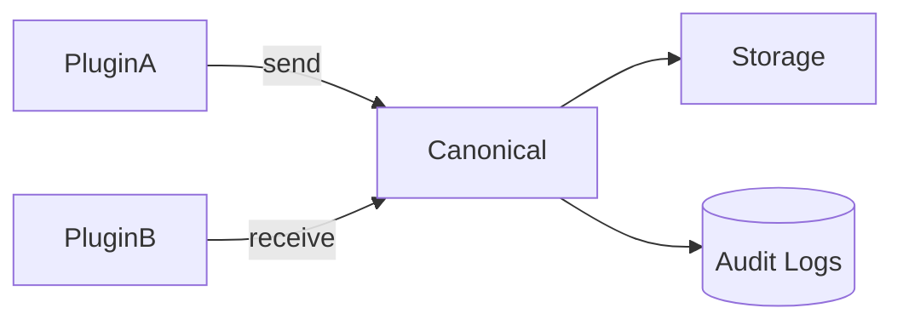
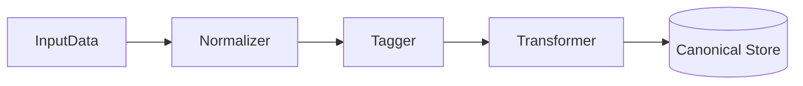

<div class='grid cards' markdown>

-   :material-format-list-bulleted:{ .lg .middle } **Canonical Service**

-   :material-account-circle:{ .lg .middle } **User Canonicals**

-   :material-sync:{ .lg .middle } **Transformation Pipelines**

</div>

!!! tip "Normalization Best Practice"
    Always map plugin-specific attributes to the CanonicalUser attributes to maintain cross-plugin compatibility.

!!! note "Implementation Note"
    The canonical service provides Pydantic models for normalized types (eg. CanonicalUser, CanonicalMessage). Plugins should import and reuse these models.

!!! danger "Critical"
    Ensure PHI/PII transformations are logged and reversible where required by policy (or flagged with irreversible scrub operations).

## Canonical models

| Model | Purpose | Key fields |
|-------|---------|------------|
| CanonicalUser | Unified user representation | id, username, email, roles, traits |
| CanonicalMessage | Standard message envelope | id, from_user, to_user, content_type, content |



### CanonicalUser (schema excerpt)

=== "Python"
    ```python
    # (1) Example Pydantic model usage
    from datetime import datetime
    from pydantic import BaseModel, Field

    class CanonicalUser(BaseModel):
        id: str
        username: str
        email: str
        roles: list[str] = Field(default_factory=list)
        traits: list[str] = Field(default_factory=list)
        created_at: datetime
        attributes: dict[str, str] = Field(default_factory=dict)
    ```

=== "Node.js"
    ```javascript
    // (1) Example of validating a canonical user in Node (pseudo)
    const user = { id: 'u1', username: 'alice', email: 'alice@example.com', roles: [] }
    // Validate with your schema library (e.g. ajv)
    ```

=== "curl"
    ```bash
    # (1) Create a canonical user via Admin API
    curl -X POST -H "Content-Type: application/json" -d '{"id":"u1","username":"alice","email":"alice@example.com"}' https://localhost:8443/api/v1/canonical/users
    ```

1. Pydantic-based model for Python

## Transformation pipeline

The canonical service supports configurable transforms:

- Normalizers (case, diacritics)
- Trait mapping
- PHI/PII tagging

| Component | Description | Configurable |
|-----------|-------------|--------------|
| Normalizer | Standardize field formats | ✅ |
| Tagger | Apply data traits/labels | ✅ |
| Transformer | Custom plugin transforms | ✅ |



??? note "Custom Transformations"
    Use plugin hooks to register custom transformers. Transformers must be idempotent and audit their outputs.

## Auditing

All canonical operations produce audit events with before/after digests. Audit logs are queryable via Admin API.

| Audit Field | Meaning | Retention |
|-------------|---------|----------|
| operation | create/update/delete | 7 years |
| actor | user or plugin | 7 years |
| diff | before/after | 7 years |

!!! success "Pro Tip"
    Use the Admin Console's storage browser to validate canonical outputs visually.
