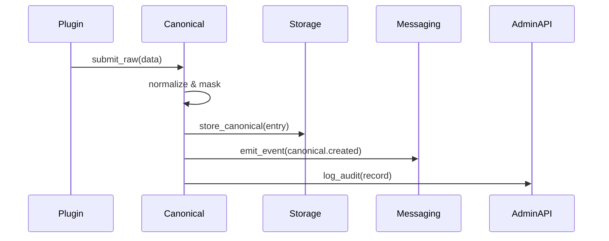

!!! info "Canonical Service — Purpose"
    The Canonical Service centralizes data normalization and transformation so that multiple plugins can interoperate safely with PHI/PII. It provides transformation rules, audit logging, and compatibility utilities.

# Canonical Service :arrows_clockwise: 

Short summary:

- Normalizes incoming data into canonical models
- Applies PHI/PII transformation and masking rules
- Emits audit entries for each transformation
- Makes canonical models available to other services via the Admin API and the event bus

## Key concepts

- Canonical Models — standard schemas for users, messages, and records used across plugins
- Transformations — deterministic conversions (normalization, redaction, enrichment)
- Audit Logs — immutable records of every transformation

!!! tip "Consistency matters"
    Use canonical models when exchanging data between plugins. This prevents duplication of transform logic and reduces risk when handling PHI.

## Canonical Models (examples)

- CanonicalUser
  - id, username, email, roles, traits, created_at, attributes

- CanonicalMessage
  - id, from_user, to_user, content_type, content, data_traits, sent_at, metadata

??? details "Canonical model example (trimmed)"
    ```json
    {
      "id": "user-123",
      "username": "alice",
      "email": "alice@example.com",
      "roles": ["clinician"],
      "created_at": "2025-01-01T00:00:00Z"
    }
    ```

## Typical workflows

1. Gateway or Plugin submits raw input to the Canonical Service.
2. Canonical Service normalizes fields and applies redaction rules for PHI.
3. A canonical object is stored and a transformation audit is written.
4. Other services or plugins subscribe to canonical objects or query them via Admin API.

Mermaid flow for normalization:



## Integration examples

=== "Python example: normalize a user"

```python
# (1) Submit raw user payload and receive canonical user
payload = {"username": "alice", "email": "alice@example.com"}

resp = client.post('/canonical/users', json=payload)  # (2)
print(resp.json())

# (1) Example input
# (2) Admin API endpoint — requires auth
```

=== "Node.js example"

```javascript
// (1) POST to canonical users endpoint
const res = await fetch(`${BASE}/canonical/users`, {
  method: 'POST',
  headers: { Authorization: `Bearer ${TOKEN}`, 'Content-Type': 'application/json' },
  body: JSON.stringify({ username: 'alice', email: 'alice@example.com' })
});
const data = await res.json();
```

## Audit & Compliance

- Every normalization writes a tamper-evident audit record.
- Audit records are queryable via Admin API with role-based access.

!!! success "Compliance"
    The Canonical Service is designed to make auditing and review straightforward: every transformation is recorded and linked to its origin.

## Troubleshooting

- If fields are missing after normalization: check transformation rules in the Admin Console under "Policies -> Transformations".
- If audit entries are not seen: verify your account role and the Audit Log retention configuration in Storage.
