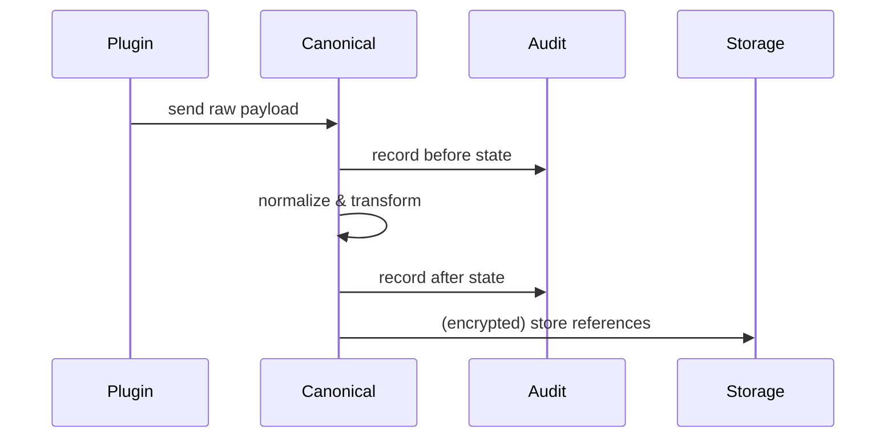

<div class='grid cards' markdown>

-   :material-format-list-bulleted:{ .lg .middle } **Canonical Service**
    
    ---
    Normalize plugin payloads to shared models

-   :material-sync:{ .lg .middle } **Transformations**
    
    ---
    PHI/PII-aware transformations with audit logging

-   :material-auto-fix:{ .lg .middle } **Compatibility**
    
    ---
    Cross-plugin compatibility layer and backward-compatible adapters

</div>

!!! tip "Use Canonical Models"
    Always convert incoming plugin data to canonical models before downstream processing.

!!! note "Audit Each Transform"
    Every transformation must produce an audit record: before, after, and transformation metadata.

!!! danger "Do Not Store Raw PHI"
    The canonical layer should not persist raw PHI outside of encrypted storage. Use ephemeral buffers only.

## Canonical Models (example)

| Model | Summary | Key Fields | PHI |
|-------|---------|------------|-----|
| CanonicalUser | User representation | id, username, email, roles | email is PHI if personal |
| CanonicalMessage | Messaging envelope | id, from_user, to_user, content | content may be PHI |


### CanonicalUser (example Pydantic)

=== "Python"
    ```python
    # (1) Pydantic canonical user
    from pydantic import BaseModel, Field
    from datetime import datetime
    from typing import List, Dict

    class CanonicalUser(BaseModel):
        id: str
        username: str
        email: str
        roles: List[str] = Field(default_factory=list)
        traits: List[str] = Field(default_factory=list)
        created_at: datetime
        attributes: Dict[str, str] = Field(default_factory=dict)
    ```

=== "Node.js"
    ```javascript
    // (1) TypeScript interface for canonical user
    interface CanonicalUser {
      id: string
      username: string
      email: string
      roles: string[]
      traits: string[]
      created_at: string
      attributes: Record<string,string>
    }
    ```

=== "curl"
    ```bash
    # (1) POST example to convert raw to canonical
    curl -X POST https://localhost:8443/api/canonical/normalize \
      -H 'Content-Type: application/json' \
      -d '{"plugin":"acme","payload":{}}'
    ```

1. CanonicalUser centralizes types used across plugins


## Transformation Flow




## Best Practices

- Validate plugin input strictly
- Use Field(default_factory=list) for lists to avoid mutable defaults
- Avoid import-time side effects in plugin adapters


### Configuration

| Option | Description | Default | HIPAA |
|--------|-------------|---------|-------|
| canonical.enforce_types | Strict type enforcement | true | N/A |
| canonical.audit_enabled | Emit transformation audit logs | true | Compliant |


- [x] Ensure canonical.audit_enabled is true in production
- [x] Do not log raw content in plaintext

??? note "Advanced Transformations"
    For complex mapping rules, implement rule sets that are versioned and auditable.
