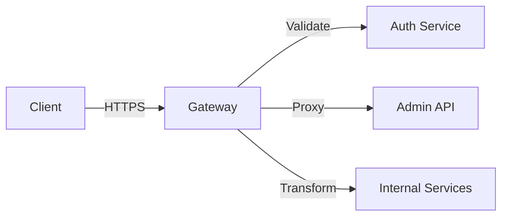

<div class='grid cards' markdown>

-   :material-gateway:{ .lg .middle } **External Gateway**

-   :material-lock_open:{ .lg .middle } **Security Validation**

-   :material-sensors:{ .lg .middle } **Rate Limiting & Monitoring**

</div>

!!! note "Design Note"
    The gateway validates and filters external requests, applies transformations, and routes to internal services.

!!! tip "Pro Tip"
    Use domain allowlists and request body schema validation to minimize attack surface.

!!! warning "Network Security"
    All external traffic must traverse the gateway and be TLS-terminated. Do not expose internal services directly.

## Gateway responsibilities

| Capability | Description | Default | Notes |
|-----------|-------------|---------|-------|
| Proxying | Forward external requests | ✅ | Uses domain allowlist |
| Request validation | Schema & security checks | ✅ | Rejects invalid payloads |
| Transformations | Request/response mapping | ✅ | Plugin-configurable |
| Rate limiting | Per-API and per-client | ✅ | Protects backend |



## Example: creating an external proxy route

=== "Python"
    ```python
    # (1) Register a domain and route via Admin API
    payload = {"domain": "api.partner.example", "target": "https://internal-service:8080"}
    import requests
    r = requests.post('https://localhost:8443/api/v1/gateway/routes', json=payload)
    ```

=== "Node.js"
    ```javascript
    // (1) Node register route (pseudo)
    const route = { domain: 'api.partner.example', target: 'https://internal-service:8080' }
    fetch('https://localhost:8443/api/v1/gateway/routes', { method: 'POST', body: JSON.stringify(route) })
    ```

=== "curl"
    ```bash
    # (1) cURL register route
    curl -X POST -H "Content-Type: application/json" -d '{"domain":"api.partner.example","target":"https://internal-service:8080"}' https://localhost:8443/api/v1/gateway/routes
    ```

1. Routes are validated and stored

??? note "Monitoring"
    The gateway emits metrics for request counts, latency, and rate-limit events to the platform metrics endpoint.

## Security & rate limiting

| Limit Type | Default | Notes |
|------------|---------|-------|
| Per-client QPS | 10 | Configurable |
| Burst | 50 | Configurable |

!!! warning "DoS Protection"
    Configure WAF rules at the gateway and ensure alerts on sustained high error rates.
