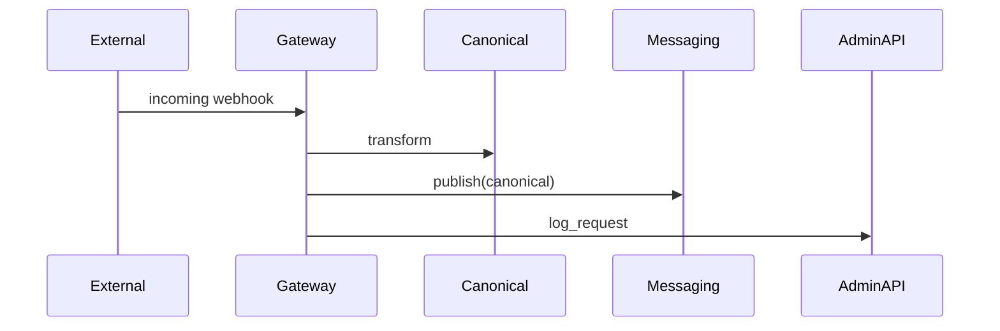

!!! tip "Gateway responsibilities"
    The Gateway provides secure external access. It is the recommended integration point for external services and third-party systems.

# Gateway Service :globe_with_meridians: 

The Gateway mediates external API access and performs request/response transformation, security validation, and rate limiting.

## User-facing features

- Domain allowlists and request validation
- Request and response transformation (e.g., normalize to Canonical models)
- Rate limiting, monitoring, and logging
- Proxying external APIs with PHI protections

## Common scenarios

- Proxy external provider APIs while masking PHI
- Accept incoming webhooks and transform into canonical messages
- Apply domain allowlists for outgoing requests

Mermaid: external proxy flow



## Example: webhook to canonical

```bash
curl -X POST https://gateway.example.com/webhooks/provider \
  -H "Content-Type: application/json" \
  -d '{"event": "message.received", "payload": {...}}'
```

## Security and Rate Limiting

- Configure allowlists for outgoing domains in the Admin Console.
- Configure per-client rate limits and alerts.

!!! warning "Sensitive routes"
    Gateways that accept inbound requests should be registered in the Admin Console and kept behind encryption and authentication.

## Troubleshooting

- Transformation failures: inspect the Gateway logs in the Admin Console and validate incoming payloads against expected schemas.
- Rate-limited traffic: review rate limit dashboards and consider whitelisting trusted clients or adjusting limits.
