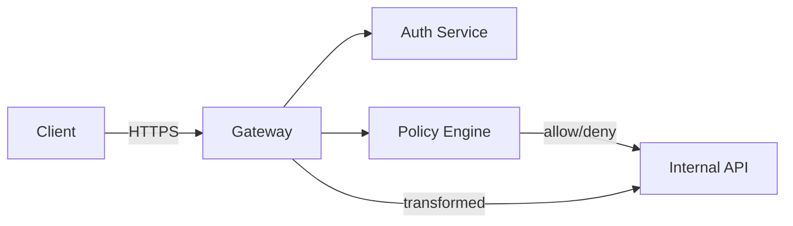

<div class='grid cards' markdown>

-   :material-gateway:{ .lg .middle } **External Gateway**
    
    ---
    Secure ingress, transformations, rate limiting, allowlists

-   :material-shield-check:{ .lg .middle } **Security & Validation**
    
    ---
    Request validation, authentication, and PII-safe proxies

-   :material-speed:{ .lg .middle } **Monitoring & Rate Limiting**
    
    ---
    Per-client throttling and observability

</div>

!!! tip "Use Gateway for All External Traffic"
    Never expose internal services directly. Route all external access through the Gateway to enforce global policies.

!!! warning "Allowlist Important Domains"
    Configure domain allowlists for upstreams and validate outbound destinations.

!!! note "Transformation Hooks"
    The Gateway supports request/response transforms; keep transformations idempotent and auditable.

## Gateway Capabilities

| Feature | Description | Status | HIPAA |
|---------|-------------|--------|-------|
| Domain allowlist | Only allow configured upstreams | Active | Compliant |
| Rate limiting | Per-client and global quotas | Active | N/A |
| Request transform | Map external shapes to internal APIs | Active | Compliant |


## Example: Proxying External API

=== "Python"
    ```python
    # (1) Proxy a request through the gateway
    import requests
    r = requests.get('https://gateway.example.com/proxy/external-api/resource', headers={'X-Api-Key':'KEY'})
    print(r.status_code, r.text)
    ```

=== "Node.js"
    ```javascript
    // (1) Node example calling gateway
    const fetch = require('node-fetch')
    fetch('https://gateway.example.com/proxy/external-api/resource', { headers:{'X-Api-Key':'KEY'} }).then(r=>r.text()).then(console.log)
    ```

=== "curl"
    ```bash
    # (1) curl proxy
    curl -H 'X-Api-Key: KEY' https://gateway.example.com/proxy/external-api/resource
    ```

1. The gateway authenticates and transforms the request before sending to internal services


## Gateway Flow




## Configuration Options

| Option | Description | Default | HIPAA |
|--------|-------------|---------|-------|
| gateway.domain_allowlist | Domains allowed for upstreams | [] | Compliant |
| gateway.rate_limit_per_min | Requests per minute per client | 600 | N/A |
| gateway.transform_logging | Log transforms for audits | true | Compliant |


## Operational Checklist

- [x] Configure domain_allowlist before enabling external proxying
- [x] Enable transform_logging for auditability
- [ ] Monitor rate limits and adjust per SLA

??? note "Debugging Gateway Rules"
    If a request is denied, check ++Policy Engine++ decisions in the logs and confirm the client's RBAC scope.
