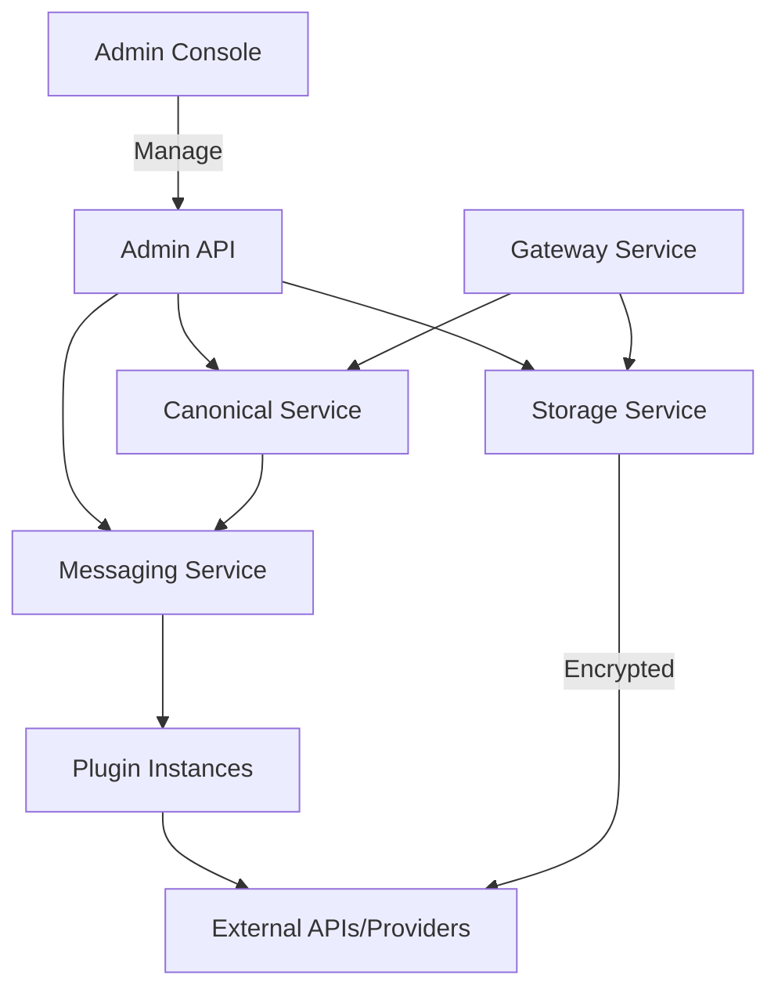

# Core Services Overview :gear: 

Vivified is composed of modular core services that collaborate to process, store, and mediate PHI/PII data across integrations. Each core service is accessible via the Admin Console and the Admin API and is designed for auditability and compliance.

Mermaid architecture overview:

Each service page provides user-focused documentation and examples.

- canonical/: Data normalization and transformation
- storage/: Encrypted storage and retention
- messaging/: Inter-plugin messaging and routing
- gateway/: External API proxy and security
- api/: Admin API and endpoints

Navigate to the service pages to learn typical workflows, examples, and configuration notes.
