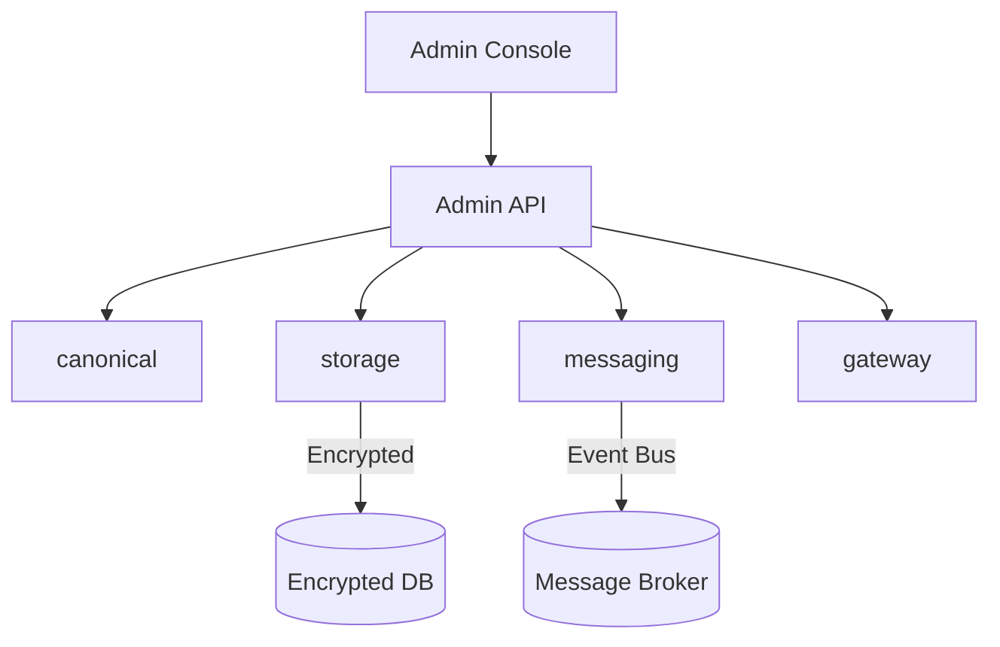

<div class='grid cards' markdown>

-   :material-shield-check:{ .lg .middle } **Core Services**
    
    ---
    
    Overview of canonical, storage, messaging, gateway

-   :material-extension:{ .lg .middle } **Plugin-Ready**
    
    ---
    
    Core services expose plugin integration points

-   :material-insights:{ .lg .middle } **Observability**
    
    ---
    
    Metrics, logs, and audit streams

</div>

!!! note "Implementation Note"
    Core services are user-facing: they provide normalized data, secure storage, messaging and gateway features to integrators and operators.

!!! tip "Pro Tip"
    Start with canonical and storage integration when adding a new plugin—data normalization and retention are foundational.

!!! warning "Security Warning"
    All core service APIs enforce RBAC and must be called via the Admin API or authorized plugin connectors.

## Core services map

| Service | Purpose | Exposed APIs | HIPAA |
|---------|---------|--------------|-------|
| canonical | Data normalization & transformation | /canonical/* | Compliant |
| storage | Encrypted PHI/PII storage | /storage/* | Compliant |
| messaging | Event bus & routing | /messaging/* | Compliant |
| gateway | External API proxy | /gateway/* | Compliant |



### How to pick a starting service

- If you need consistent user data across plugins => canonical
- If you need long-term PHI/PII storage => storage
- If you need cross-plugin events => messaging
- If you need to expose external endpoints => gateway

??? note "Service SLAs & Retention"
    Each service has configuration-driven retention and SLA settings. See /docs/configuration.md for per-service options.

## Quick integration example (send a canonical message)

=== "Python"
    ```python
    # (1) Build a canonical message payload
    payload = {
        "from_user": "alice",
        "to_user": "bob",
        "content_type": "text/plain",
        "content": b"Hello, Bob!",
    }
    # (2) Post to Admin API
    import requests
    r = requests.post('https://localhost:8443/api/v1/messaging/send', json=payload)
    ```

=== "Node.js"
    ```javascript
    // (1) Node example using fetch
    const payload = { from_user: 'alice', to_user: 'bob', content_type: 'text/plain', content: Buffer.from('Hello Bob!').toString('base64') }
    fetch('https://localhost:8443/api/v1/messaging/send', { method: 'POST', body: JSON.stringify(payload) })
    ```

=== "curl"
    ```bash
    # (1) cURL example
    curl -X POST -H "Content-Type: application/json" -d '{"from_user":"alice","to_user":"bob","content_type":"text/plain","content":"SGVsbG8sIEJvYg=="}' https://localhost:8443/api/v1/messaging/send
    ```

1. Build canonical payload
2. Use Admin API to submit messages

!!! info "Compatibility"
    Plugins should accept canonical payloads from the canonical service rather than defining their own ad-hoc formats to maximize interoperability.

## See also
- core/canonical.md
- core/storage.md
- core/messaging.md
- core/gateway.md
