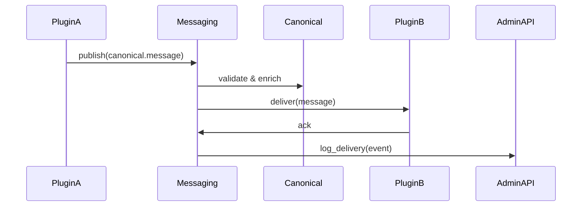

!!! info "Messaging: Inter-plugin communication"
    The Messaging Service provides an event bus and message routing for plugins. It ensures message-level protections for PHI/PII and writes audit logs for message flows.

# Messaging Service :speech_balloon: 

Core responsibilities:

- Publish/subscribe event bus for canonical messages
- Message routing, filtering, and delivery guarantees
- PHI-aware filtering and redaction policies
- Audit logging for each message lifecycle

## How it works (user perspective)

- Plugins publish canonical messages to topics or channels.
- Messaging routes messages to subscribed plugins, applying filters and protections.
- Delivery is recorded in the audit log, and retries are observed in the Admin Console.

Mermaid: message flow



## Typical operations

- Subscribe to a topic via plugin manifest or Admin Console
- Publish messages via API or SDK
- Inspect delivery status in the Admin Console

=== "Publish example (curl)"

```bash
curl -X POST "https://api.example.com/messaging/publish" \
  -H "Authorization: Bearer <KEY>" \
  -H "Content-Type: application/json" \
  -d '{"topic": "canonical.messages", "message": {"from_user": "user-1", "to_user": "user-2", "content": "SGVsbG8=", "content_type": "text/plain"}}'
```

## Filters and Privacy

- Message routing supports rule-based filters; use the Admin Console to define filters that strip or mask sensitive fields before delivery.
- Use data traits to flag messages that require special handling (e.g., high-sensitivity).

!!! warning "Do not bypass filters"
    Filters and protections are enforced system-wide; bypassing them exposes PHI and may violate compliance rules.

## Troubleshooting

- Messages not delivered: check subscription filters, delivery retries, and plugin health in the Admin Console.
- Unexpected message contents: confirm transformation rules in Canonical and check message filter rules.
