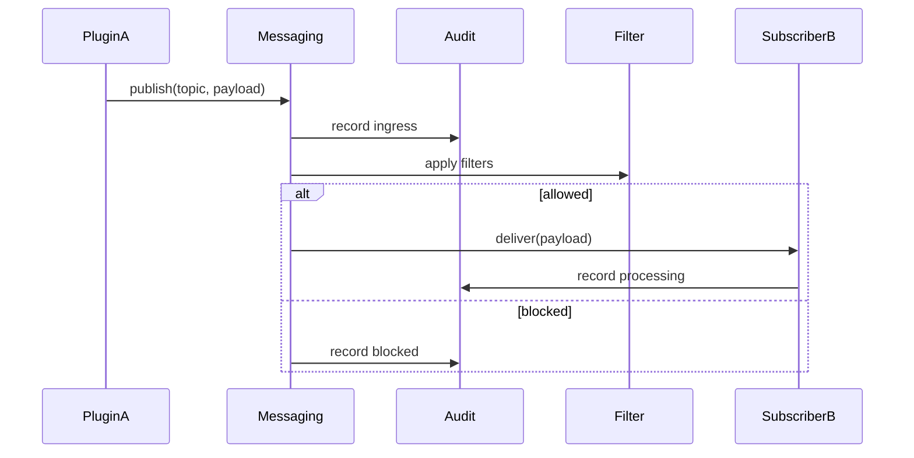

<div class='grid cards' markdown>

-   :material-forum:{ .lg .middle } **Messaging (Event Bus)**
    
    ---
    HIPAA-aware routing, filtering, and audit for inter-plugin events

-   :material-filter:{ .lg .middle } **Routing & Filters**
    
    ---
    Topic and attribute-based routing with PII filters

-   :material-history:{ .lg .middle } **Guaranteed Delivery**
    
    ---
    Exactly-once semantics where supported; durable queues

</div>

!!! note "PII-safe Messaging"
    Strip or encrypt PII in transit according to plugin contract. Use canonical models to minimize PII exposure.

!!! tip "Audit Every Event"
    Emit an audit record for message ingress and egress to support traceability.

!!! warning "Do Not Bypass Filters"
    Plugins must not bypass message filters. Bypassing can result in PHI leakage.

## Messaging Concepts

| Concept | Description | Behavior | HIPAA |
|---------|-------------|----------|-------|
| Topic | Named channel for events | Subscribed by plugins | N/A |
| Filter | Attribute-based filter | Drops or transforms payload | Compliant |
| Audit | Event audit trail | Immutable record | Compliant |


## Example Publish/Subscribe

=== "Python"
    ```python
    # (1) Publish an event
    import requests
    evt = {'topic':'messages.new','payload':{'from':'user1','to':'user2','content':'...'}}
    r = requests.post('https://localhost:8443/messaging/publish', json=evt)
    print(r.status_code)
    ```

=== "Node.js"
    ```javascript
    // (1) Publish with fetch
    const fetch = require('node-fetch')
    fetch('https://localhost:8443/messaging/publish', { method:'POST', body:JSON.stringify(evt), headers:{'Content-Type':'application/json'} })
    ```

=== "curl"
    ```bash
    # (1) curl publish
    curl -X POST https://localhost:8443/messaging/publish -H 'Content-Type: application/json' -d '{"topic":"messages.new","payload":{}}'
    ```

1. Publishing creates an audit entry and routes message to subscribers


## Message Flow




## Configuration

| Option | Description | Default | HIPAA |
|--------|-------------|---------|-------|
| messaging.max_payload_size | Max bytes per message | 1MB | Compliant |
| messaging.filter_mode | fail-open / fail-closed | fail-closed | Compliant |
| messaging.audit_enabled | Persist audit events | true | Compliant |


## Best Practices

- Keep messages small and reference large blobs via storage IDs
- Encrypt sensitive payload fields before publishing
- Use canonical models for payloads to ensure consistent filtering

- [x] Verify messaging.audit_enabled is true in production

??? note "Troubleshooting subscriptions"
    If a subscriber is missing messages, check filter rules, subscription health, and audit logs.
