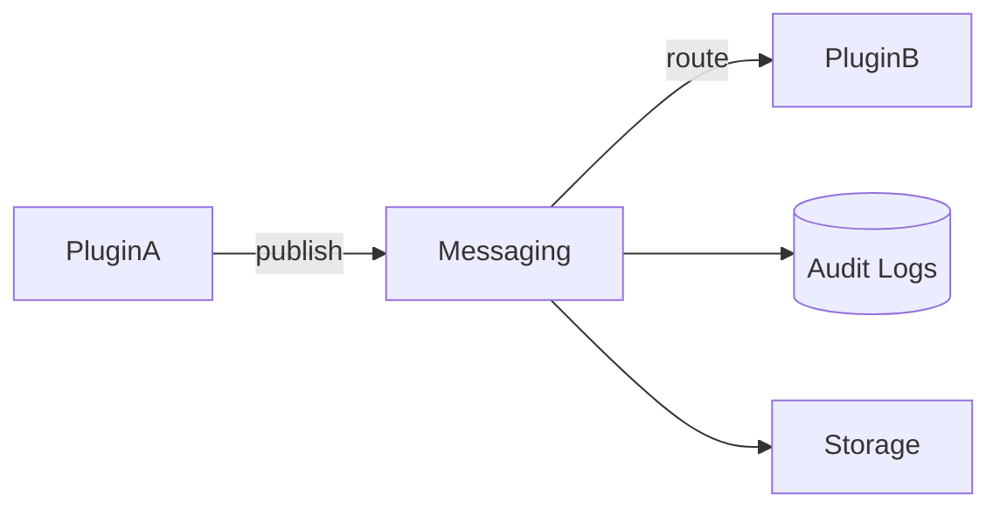

<div class='grid cards' markdown>

-   :material-forum:{ .lg .middle } **Messaging (Event Bus)**

-   :material-filter_list:{ .lg .middle } **Routing & Filters**

-   :material-history:{ .lg .middle } **Message Audit Trails**

</div>

!!! tip "Design Tip"
    Use canonical messages to encapsulate payloads and avoid leaking schema differences between plugins.

!!! note "Operational Note"
    The messaging layer enforces PHI/PII protection—messages flagged with PHI are handled with stricter routing and audit requirements.

!!! warning "Throughput Warning"
    For high-volume plugins, configure partitioning and backpressure to avoid message loss.

## Messaging features

| Feature | Description | Default | HIPAA |
|---------|-------------|---------|-------|
| Event bus | Pub/Sub or broker-backed bus | Broker | Compliant |
| Routing | Topic and attribute routing | ✅ | Compliant |
| Filters | Policy-driven filtering | ✅ | Compliant |
| Replay | Replay events for recovery | Configurable | Compliant |



## Publish/subscribe examples

=== "Python"
    ```python
    # (1) Publish a canonical message
    import requests
    payload = {"from_user":"alice","to_user":"bob","content":"SGVsbG8=","content_type":"text/plain"}
    requests.post('https://localhost:8443/api/v1/messaging/publish', json=payload)
    ```

=== "Node.js"
    ```javascript
    // (1) Node publish example
    const payload = { from_user: 'alice', to_user: 'bob', content: Buffer.from('Hi').toString('base64') }
    fetch('https://localhost:8443/api/v1/messaging/publish', { method: 'POST', body: JSON.stringify(payload) })
    ```

=== "curl"
    ```bash
    # (1) cURL publish
    curl -X POST -H "Content-Type: application/json" -d '{"from_user":"alice","to_user":"bob","content":"SGVsbG8=","content_type":"text/plain"}' https://localhost:8443/api/v1/messaging/publish
    ```

1. Publish via Admin API

??? note "Filtering & Policy"
    Message filters operate using message traits. Tag PHI messages with the appropriate data traits to trigger stricter routing.

## Replay & Dead Letter Queues

- Messages that fail processing are sent to DLQs for manual inspection
- Replay is supported for investigation and recovery

| Queue | Purpose | Retention |
|-------|---------|-----------|
| DLQ | Failed messages | 30 days |
| Replay | Reprocessable events | Configurable |

!!! success "Operational Tip"
    Subscribe an admin-only consumer to DLQs to expedite failure triage.
