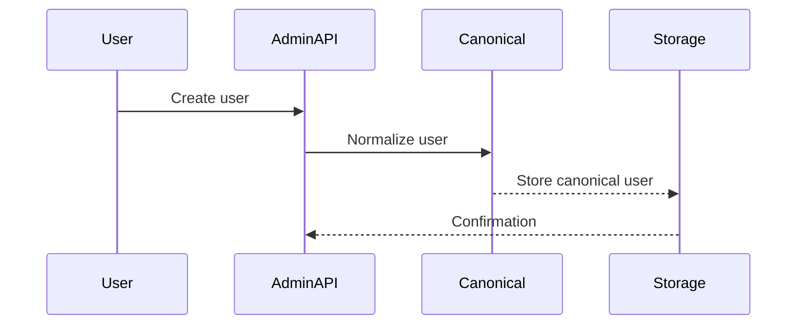

-   :material-shield-check:{ .lg .middle } **Core Overview**

-   :material-security:{ .lg .middle } **Compliance-Centric**

-   :material-compare:{ .lg .middle } **Interoperability**

!!! tip "Start Here"
    Read the canonical and storage docs before implementing plugins that handle user data.

!!! note "Design Note"
    Core services prioritize auditability and configurable retention aligned with HIPAA constraints.

!!! warning "Operational Warning"
    Do not bypass audit logs. All transformation and storage operations are logged and retained per configured policies.

## Architecture summary

| Layer | Responsibility | Examples | HIPAA |
|-------|----------------|----------|-------|
| Presentation | Admin Console, APIs | /admin/ui, /api | Compliant |
| Core Logic | canonical, storage, messaging, gateway | Plugins call these | Compliant |
| Data | Encrypted DBs, Brokers | Postgres (encrypted), Kafka | Compliant |

## Observability & audit

- Centralized audit logs with 7-year retention by default (configurable)
- Metrics exposed via /metrics for Prometheus

| Feature | Endpoint | Default Retention |
|---------|----------|-------------------|
| Audit Logs | /admin/audit | 7 years |
| Metrics | /metrics | 90 days |

## Common integration workflow

- Register plugin in Admin Console
- Request RBAC roles & scopes
- Send test data through canonical service
- Validate stored records via storage browser in Admin Console

- [ ] Register plugin
- [ ] Request roles
- [ ] Test normalization pipeline

??? note "Advanced Tuning"
    Use configuration options in /docs/configuration.md to tune retention, encryption keys, and messaging partitions.
