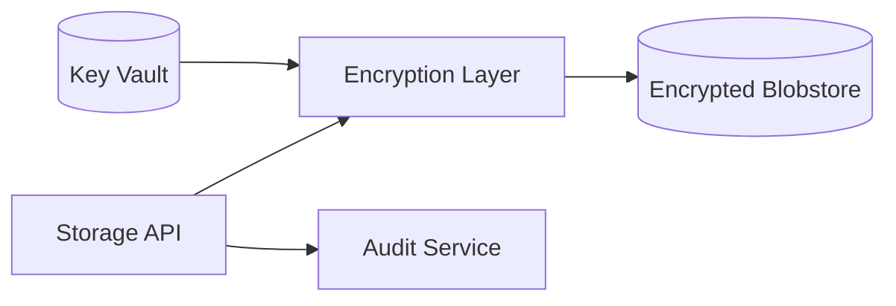

<div class='grid cards' markdown>

-   :material-database:{ .lg .middle } **Encrypted Storage**
    
    ---
    AES-256 at rest, per-tenant keying, automatic tagging

-   :material-lock:{ .lg .middle } **Retention & Audit**
    
    ---
    7-year retention for audit logs, immutable manifests

-   :material-folder-key:{ .lg .middle } **Classification**
    
    ---
    Automatic PHI/PII classification and tagging on ingest

</div>

!!! danger "HIPAA Reminder"
    Storage operations often contain PHI/PII. Ensure correct encryption and access controls before performing exports.

!!! tip "Key Management"
    Use a central Key Vault for envelope keys. Rotate keys regularly and audit access.

!!! note "Retention Policy"
    Audit logs must be retained for at least 7 years by default; configurable in Admin Console.

## Storage API Summary

| Endpoint | Purpose | Auth | HIPAA |
|----------|---------|------|-------|
| POST /storage/objects | Store an encrypted object | RBAC | Compliant |
| GET /storage/objects/{id} | Retrieve object (checks access) | RBAC | Compliant |
| DELETE /storage/objects/{id} | Soft-delete and retention | RBAC | Compliant |


## Example Usage

=== "Python"
    ```python
    # (1) Upload encrypted blob to storage
    import requests
    headers = {'Authorization': 'Bearer TOKEN'}
    data = {'meta': {'classification': 'phi'}}
    files = {'file': ('payload.bin', b'secret bytes')}
    r = requests.post('https://localhost:8443/storage/objects', headers=headers, data=data, files=files)
    print(r.status_code, r.json())
    ```

=== "Node.js"
    ```javascript
    // (1) Node upload using fetch
    const fetch = require('node-fetch')
    const FormData = require('form-data')
    const fd = new FormData()
    fd.append('file', Buffer.from('secret bytes'), 'payload.bin')
    fd.append('meta', JSON.stringify({classification:'phi'}))
    fetch('https://localhost:8443/storage/objects', { method: 'POST', body: fd, headers: { Authorization: 'Bearer TOKEN' } })
    ```

=== "curl"
    ```bash
    # (1) curl upload
    curl -X POST https://localhost:8443/storage/objects \
      -H 'Authorization: Bearer TOKEN' \
      -F 'file=@payload.bin' \
      -F 'meta={"classification":"phi"}'
    ```

1. Always tag uploaded objects with classification metadata for policy enforcement


## Storage Architecture




## Configuration Options

| Option | Description | Default | HIPAA |
|--------|-------------|---------|-------|
| storage.encryption_algo | Disk encryption algorithm | AES-256-GCM | Compliant |
| storage.key_rotation_days | Rotation interval for envelope keys | 90 | Compliant |
| storage.audit_retention_years | Audit retention | 7 | Compliant |


## Operational Notes

- Use tenant-scoped keys for multi-tenant deployments
- Soft-delete should not immediately purge data if retention policy applies

- [x] Ensure key rotation is scheduled
- [x] Verify audit logs are immutable and replicated

??? note "Exporting Data"
    When exporting data, mask PHI fields unless export is explicitly authorized and audited.
