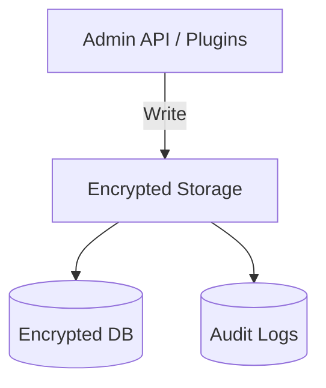

<div class='grid cards' markdown>

-   :material-database:{ .lg .middle } **Encrypted Storage**

-   :material-lock:{ .lg .middle } **HIPAA Compliant**

-   :material-label:{ .lg .middle } **Classification & Tagging**

</div>

!!! tip "Encryption Best Practice"
    Use KMS-backed encryption keys and rotate keys periodically following org policy.

!!! note "Retention Note"
    Default retention for audit and PHI is 7 years; override via configuration per dataset.

!!! danger "Critical"
    Deleting data before retention policies expire may violate compliance. Ensure deletion flows respect retention windows and legal holds.

## Storage capabilities

| Feature | Description | Default | HIPAA |
|---------|-------------|---------|-------|
| Encryption at rest | AES-256 or KMS-backed | ✅ Active | Compliant |
| Access controls | RBAC + plugin scopes | ✅ Active | Compliant |
| Retention policies | Configurable policies per dataset | 7 years default | Compliant |
| Audit logs | All accesses recorded | ✅ Active | Compliant |



## Configuration options (storage)

| Option | Type | Default | Description |
|--------|------|---------|-------------|
| encryption.kms_key | string | "" | KMS key ARN or identifier |
| retention.days | int | 2555 | Retention in days (7 years) |
| classification.auto_tag | bool | true | Auto-tag data with PHI/PII traits |
| audit.retention | int | 2555 | Audit retention in days |

### Example: storing an object

=== "Python"
    ```python
    # (1) Upload an object to encrypted storage via Admin API
    import requests
    obj = {"key":"patient/123/record.json","data":"{\"name\":\"Alice\"}"}
    r = requests.post('https://localhost:8443/api/v1/storage/objects', json=obj)
    ```

=== "Node.js"
    ```javascript
    // (1) Upload object using fetch (pseudo)
    const obj = { key: 'patient/123/record.json', data: JSON.stringify({ name: 'Alice' }) }
    fetch('https://localhost:8443/api/v1/storage/objects', { method: 'POST', body: JSON.stringify(obj) })
    ```

=== "curl"
    ```bash
    # (1) cURL upload
    curl -X POST -H "Content-Type: application/json" -d '{"key":"patient/123/record.json","data":"{\"name\":\"Alice\"}"}' https://localhost:8443/api/v1/storage/objects
    ```

1. Use Admin API to interact with storage
2. Objects are classified and encrypted automatically

??? note "Retention & Legal Holds"
    Use the Admin Console to place legal holds which prevent deletion even if retention expires.

## Audit & Access

- Access attempts require RBAC checks
- Failed access attempts are recorded and alerted on

| Access Type | Triggers Alert | Notes |
|-------------|----------------|-------|
| Unauthorized read | ✅ | Immediate alert |
| Unauthorized write | ✅ | Immediate alert |

!!! warning "Access Controls"
    Ensure plugin tokens are scoped to minimal privileges necessary for their function.
