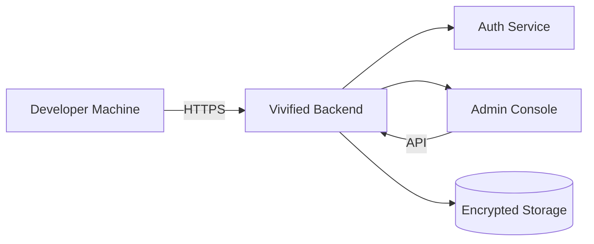

<div class='grid cards' markdown>

-   :material-rocket:{ .lg .middle } **Quick Start**
    
    ---
    Get the platform running locally with CI-parity preflight

-   :material-account-box:{ .lg .middle } **Admin First**
    
    ---
    Everything is available in the Admin Console (no CLI-only features)

-   :material-help-circle:{ .lg .middle } **Support & Docs**
    
    ---
    Links to API Reference, Plugins, and Security Compliance

</div>

!!! tip "Local CI Parity (Best Practice)"
    Run exactly what CI runs locally before pushing to avoid failing checks. Use Python 3.11 and the pinned tools in core/requirements.txt.

!!! note "Admin Console Requirement"
    All features must be reachable from the Admin Console. If you find a CLI-only feature, raise it to the UI team.

!!! warning "HIPAA Sensitive"
    This platform handles PHI/PII. Do not expose data in logs or test fixtures. Mask or anonymize when needed.

## Table of Contents

- [Prerequisites](#prerequisites)
- [Quick Install](#quick-install)
- [Run Local Parity (CI Mirror)](#run-local-parity-ci-mirror)
- [Admin Console Access](#admin-console-access)
- [Next Steps](#next-steps)


## Prerequisites

- Python 3.11
- Node 20.x (recommended for Admin UI builds)
- Docker (optional for images)

??? note "System check"
    Ensure you have the right Python version: ++python3.11 --version++


## Quick Install

Follow these steps to create a local dev environment and run the preflight checks.

- [x] Create virtualenv
- [x] Install pinned dependencies
- [x] Run lint, type, and tests

=== "Python"
    ```python
    # (1) Create and activate venv
    python3.11 -m venv .venv && . .venv/bin/activate

    # (2) Install exact dependencies like CI
    pip install -r core/requirements.txt \
      black==25.9.0 flake8==7.3.0 mypy==1.18.2 sqlalchemy==2.0.23 \
      pytest pytest-cov pytest-asyncio

    # (3) Run local checks
    import os
    os.system('black --check core/')
    os.system('flake8 core/')
    os.system('mypy --config-file mypy.ini core/')
    os.system('PYTHONPATH=$PWD pytest -q')
    ```

=== "Node.js"
    ```javascript
    // (1) Example script to build UI if node is present
    const { execSync } = require('child_process')
    try {
      execSync('cd core/ui && npm ci && npm run build', { stdio: 'inherit' })
    } catch (e) {
      console.error('UI build failed')
      process.exit(1)
    }
    ```

=== "curl"
    ```bash
    # (1) Quick check to ensure server responds (after starting)
    curl -k https://localhost:8443/health
    ```

1. Creates the virtual environment and activates it
2. Installs pinned dependencies used by CI
3. Runs the local checks (lint/type/test) — must pass before push


## Run Local Parity (CI Mirror)

Use the recommended make targets and pre-commit hooks to mirror CI behavior.

- [x] Install pre-commit
- [x] Install pre-push pytest hook
- [ ] Optional: Build UIs locally

=== "Python"
    ```python
    # (1) Install pre-commit and enable hooks
    import os
    os.system('pip install pre-commit')
    os.system('pre-commit install -t pre-commit -t pre-push')
    ```

=== "Node.js"
    ```javascript
    // (1) Local UI build (only if node exists)
    const { execSync } = require('child_process')
    try { execSync('make ui-ci-local', { stdio: 'inherit' }) } catch (e) { }
    ```

=== "curl"
    ```bash
    # (1) Example agent gate invocation (polls GitHub for merge)
    REPO=owner/repo PR_NUMBER=123 GITHUB_TOKEN=ghp_xxx \
      python tools/scripts/agent_gate.py --wait-merge
    ```

1. Installs pre-commit hooks used by CI


## Admin Console Access

- Start the backend services then open the Admin Console URL.
- All management tasks (users, plugins, config, audit) are available in the UI.

!!! info "Keyboard Shortcuts"
    Use ++ctrl+k++ to open the global search in Admin Console and ++ctrl+s++ to save forms.


## Configuration Summary

| Option | Description | Default | HIPAA |
|--------|-------------|---------|-------|
| storage.encryption_key | Key used for AES-256 at rest | generated | Compliant |
| ui.enable_admin | Enable Admin Console routes | true | N/A |
| audit.retention_years | Audit log retention in years | 7 | Compliant |


## Architecture Overview




## Next Steps

- [ ] Read Core Services docs (canonical, storage, messaging, gateway)
- [ ] Review API Reference for Admin endpoints
- [ ] Follow Plugin Development Guide to write plugins

??? note "Advanced: CI Tips"
    If you need to run only lint/type/test, use ++make ci-local++ to reduce startup time.

[^1]: Ensure your environment matches CI versions exactly to avoid false negatives.
