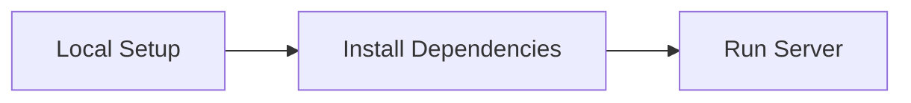

# Getting Started with Vivified Platform

<div class='grid cards' markdown>

-   :material-rocket:{ .lg .middle } **Quick Launch**
    
    ---
    
    Fast setup with minimal configuration.

-   :material-lightbulb-on:{ .lg .middle } **Best Practices**
    
    ---
    
    Follow recommended guidelines for optimal performance.

</div>

!!! tip "Pro Tip"
    Ensure you have Docker and Node.js installed to streamline the setup process.

## Prerequisites

Before starting, make sure you have the following tools installed:

| Tool        | Version     | Required |
|-------------|-------------|----------|
| Docker      | Latest      | ✅       |
| Node.js     | 14.x or LTS | ✅       |
| Python      | 3.11        | ✅       |

=== "Python"
    ```python
    # Set up a virtual environment
    python3.11 -m venv .venv && . .venv/bin/activate
    ```

=== "Node.js"
    ```bash
    # Install node modules
    npm ci && npm run build
    ```

=== "curl"
    ```bash
    # Verify installation with curl command
    curl -X GET http://localhost:8000/api/status
    ```



??? note "Advanced Configuration Options"
    For more advanced setups, refer to the Configuration Reference section.
