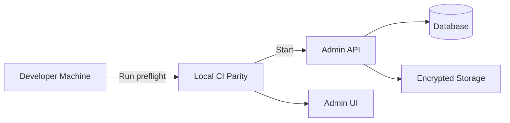

<div class='grid cards' markdown>

-   :material-rocket:{ .lg .middle } **Quick Start**
    
    ---
    
    Start the Vivified platform locally and access the Admin Console

-   :material-rocket-launch:{ .lg .middle } **Local CI Parity**
    
    ---
    
    Run exactly what CI runs before every push

-   :material-account-circle:{ .lg .middle } **User Setup**
    
    ---
    
    Create admin users and initial configuration

</div>

!!! tip "Quick Tip"
    Create a Python 3.11 virtual environment and pin versions to match CI for deterministic behavior.

!!! note "Implementation Note"
    The local CI parity steps mirror CI and must be run before pushing. This prevents the "THIS MANY ERRORS" flood.

!!! warning "Security Warning"
    Do not expose sensitive credentials in examples. Use environment variables and a secrets manager.

## Table of contents
- [Prerequisites](#prerequisites)
- [Local Preflight (recommended)](#local-preflight-recommended)
- [Start Services (dev)](#start-services-dev)
- [Admin Console Access](#admin-console-access)
- [Next steps](#next-steps)

---

## Prerequisites

- Python 3.11
- Node 20.x (optional for Admin UIs)
- Docker (for local containerized runs)

!!! info "Environment Note"
    Use ++ctrl+c++ / ++ctrl+v++ to copy commands into terminals. Use a dedicated developer machine or container for sensitive PHI/PII testing.

??? note "Why Python 3.11?"
    Python 3.11 matches CI. Using different Python versions causes subtle mypy/flake8 mismatches.

## Local Preflight (recommended)

Follow these steps exactly as CI runs them. This ensures parity and keeps branch protection green.

| Step | Command | Purpose | Status |
|------|---------|---------|--------|
| Create venv | python3.11 -m venv .venv | Isolate dependencies | Required |
| Install deps | pip install -r core/requirements.txt \  black==25.9.0 ... | Match CI pinned tools | Required |
| Lint | black --check core/; flake8 core/ | Code style & quality | Required |
| Typecheck | mypy --config-file mypy.ini core/ | Static typing | Required |
| Tests | PYTHONPATH=$PWD pytest -q | Unit/integration tests | Required |

!!! success "Success"
    If all checks pass locally you have strong confidence CI will pass. Use pre-commit to automate this.

=== "Python"
    ```python
    # (1) Create and activate venv
    python3.11 -m venv .venv  # (2)
    . .venv/bin/activate
    # (3) Install dependencies
    pip install -r core/requirements.txt \
      black==25.9.0 flake8==7.3.0 mypy==1.18.2 sqlalchemy==2.0.23 \
      pytest pytest-cov pytest-asyncio
    ```

=== "Node.js"
    ```javascript
    // (1) Optional: ensure Node 20.x or lts/* is used
    // (2) In core/ui and core/admin_ui
    // npm ci && npm run build
    ```

=== "curl"
    ```bash
    # (1) Example healthcheck against Admin API
    curl -H "Authorization: Bearer $ADMIN_TOKEN" https://localhost:8443/admin/health
    ```

1. Use Python 3.11 for parity
2. Pinned tool versions mirror CI
3. Tests must pass locally before pushing

## Start Services (development)

Follow this checklist to start services locally (non-production).

- [x] Create venv and install deps
- [x] Run database migrations (if using local DB)
- [ ] Start core services via docker-compose or make targets

=== "Python"
    ```python
    # (1) Run a lightweight dev server (example)
    export FLASK_ENV=development
    PYTHONPATH=$PWD python -m core.app
    ```

=== "Node.js"
    ```javascript
    // (1) Start Admin UI in dev mode
    cd core/admin_ui
    npm ci
    npm run dev
    ```

=== "curl"
    ```bash
    # (1) Smoke test API
    curl -k https://localhost:8443/api/v1/health
    ```

1. Lightweight dev server for API
2. Admin UI dev server
3. Quick smoke test endpoint



??? note "Local CI Parity Details"
    Running the `make ci-local` target (if provided) bundles lint/type/test steps and mirrors CI.

## Admin Console Access

- Default URL: https://localhost:8443/admin/ui
- Recommended: use a browser profile that isolates cookies and sessions.

| Item | Default | Notes | HIPAA |
|------|---------|-------|-------|
| Admin Console URL | /admin/ui | SPA served by Admin API | Compliant |
| Login | OAuth2 / SSO | RBAC enforced | Compliant |

!!! danger "Critical"
    Never use production credentials in local environments. Use test accounts or ephemeral tokens.

## Next steps

- Read core service docs in /docs/core/
- Read plugin development guide in /docs/plugins/
- Explore API Reference /docs/api-reference.md

- [ ] Review Security & Compliance guide
- [ ] Configure retention and audit policies

??? note "Advanced"
    For CI-like UI builds, run ++make ui-ci-local++. This target runs UI builds only when Node is present and fails fast on build errors.
