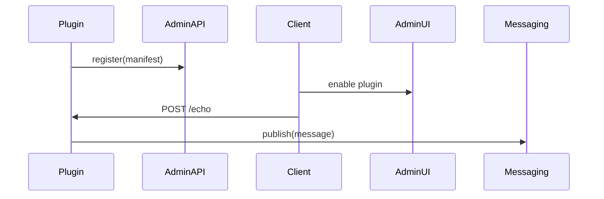

<div class='grid cards' markdown>

-   :material-widgets:{ .lg .middle } **Plugin Development**
    
    ---
    Build modular plugins that interoperate with core services

-   :material-cogs:{ .lg .middle } **Plugin SDKs**
    
    ---
    Use Python/Node SDKs to register and interact with the platform

-   :material-storefront:{ .lg .middle } **Marketplace**
    
    ---
    Plugins can be registered and managed via Admin Console

</div>

!!! tip "Follow Canonical Models"
    Map plugin payloads to canonical models before emitting events or storing data.

!!! note "Admin Console Registration"
    Register plugins through the Admin Console so operators can manage lifecycle, RBAC, and settings.

!!! warning "Avoid Import-Time Side Effects"
    Do not perform network or DB calls at import time in plugin modules. Use lazy initialization.

## Plugin Basics

| Topic | What to Do | Required | UI Manageable |
|-------|------------|----------|----------------|
| Registration | Expose manifest + endpoints | Yes | Yes |
| Configuration | Use Admin Console for settings | Required | Yes |
| Secrets | Use Key Vault, not env vars | Required | Managed via UI |


## Plugin Manifest (example)

=== "Python"
    ```python
    # (1) Minimal manifest structure
    manifest = {
      'id': 'com.example.echo',
      'name': 'Echo Plugin',
      'version': '1.0.0',
      'endpoints': ['/echo']
    }
    ```

=== "Node.js"
    ```javascript
    // (1) JavaScript manifest
    module.exports = {
      id: 'com.example.echo',
      name: 'Echo Plugin',
      version: '1.0.0',
      endpoints: ['/echo']
    }
    ```

=== "curl"
    ```bash
    # (1) Register plugin via Admin API
    curl -X POST https://localhost:8443/api/plugins \
      -H 'Content-Type: application/json' \
      -d '{"id":"com.example.echo","name":"Echo Plugin","version":"1.0.0"}'
    ```

1. The manifest allows the Admin Console to index and install the plugin


## Development Workflow

- [x] Scaffold plugin with provided SDK templates
- [x] Implement canonical mapping
- [x] Add RBAC scopes for actions
- [x] Provide Admin Console UI hooks for configuration

### Example: Echo Endpoint




## Testing & CI

- Use pytest and pytest-asyncio for Python plugins
- Ensure mypy and flake8 pass locally (see Getting Started)
- Include UI smoke tests if plugin provides Admin UI components

| Test Type | Purpose | Run Locally | CI Required |
|-----------|---------|-------------|-------------|
| Unit | Logic correctness | Yes | Yes |
| Integration | Interacts with core services | Optional | Yes |
| UI Smoke | Admin UI components | Optional | Yes |


??? note "Packaging and Marketplace"
    Package your plugin as a tarball or container image. Use the Admin Console to publish to the internal marketplace.
