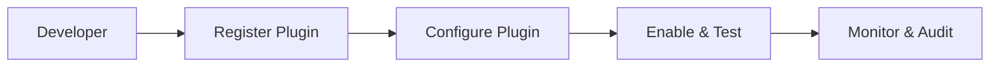

<div class='grid cards' markdown>

-   :material-widgets:{ .lg .middle } **Plugin Development**

-   :material-developer_board:{ .lg .middle } **Developer Tools**

-   :material-storefront:{ .lg .middle } **Marketplace Integration**

</div>

!!! tip "Developer Tip"
    Build plugins against the canonical models to gain immediate compatibility with other services and UI components.

!!! note "Accessibility Mandate"
    All plugin capabilities must be operable from the Admin Console—no CLI-only features.

!!! danger "Security Warning"
    Plugins handling PHI must be scoped and audited. Minimally privilege plugin tokens.

## Plugin lifecycle

| Stage | What to do | UI Steps |
|-------|------------|----------|
| Register | Add plugin metadata | Admin Console -> Plugins -> Add |
| Configure | Provide credentials & config | Admin Console -> Plugin Setup |
| Enable | Toggle plugin on | Admin Console -> Plugins |



## Development checklist

- [x] Use canonical models for data
- [x] Expose plugin settings in Admin Console
- [x] Provide health checks and smoke tests
- [ ] Add storage/browser integration if persisting PHI

### Minimal plugin manifest (example)

=== "Python"
    ```python
    # (1) Example plugin manifest
    manifest = {
        "id": "com.example.plugin",
        "name": "Example Plugin",
        "capabilities": ["send_messages","store_records"],
    }
    ```

=== "Node.js"
    ```javascript
    // (1) Example manifest in JS
    const manifest = { id: 'com.example.plugin', name: 'Example Plugin', capabilities: ['send_messages', 'store_records'] }
    ```

=== "curl"
    ```bash
    # (1) Register manifest via Admin API
    curl -X POST -H "Content-Type: application/json" -d '{"id":"com.example.plugin","name":"Example Plugin","capabilities":["send_messages"]}' https://localhost:8443/api/v1/plugins/register
    ```

1. Include id, name, and capabilities

??? note "Testing"
    Provide unit tests and pytest-asyncio tests for async plugin components. Use in-memory SQLite for DB tests.

## UI Integration points

- Provide React components for Settings and Health in the Admin Console
- Register routes under /admin/ui/plugins/{plugin_id}

| Component | Path | Notes |
|-----------|------|-------|
| Settings | /admin/ui/plugins/{id}/settings | Exposed via plugin manifest |
| Health | /admin/ui/plugins/{id}/health | Show smoke-test results |

!!! success "Pro Tip"
    Ship a Provider Setup Wizard component to minimize configuration errors for operators.
