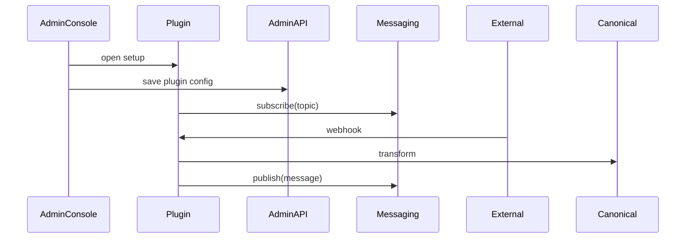

!!! note "Admin Console first"
    All plugin capabilities must be manageable from the Admin Console. No CLI-only features.

# Plugin Development Guide :wrench: 

This guide helps developers build plugins that integrate with Vivified while respecting PHI/PII protections and auditability.

## Goals (user-facing)

- Integrate external systems safely
- Use canonical models to exchange data
- Be discoverable and manageable via the Admin Console
- Emit auditable events for all PHI/PII interactions

## Plugin responsibilities

- Validate and transform inbound/outbound data to canonical models
- Register health and readiness endpoints consumed by the platform
- Provide a manifest describing capabilities and Admin Console UI hooks
- Respect message routing and filtering rules

!!! tip "Keep manifests simple"
    A plugin manifest should include display metadata, required roles, required configuration keys, and health endpoints. The Admin Console uses the manifest to render setup workflows.

## Manifest (user-facing example)

```yaml
name: Example Provider
description: Connects to Example API for message fan-out
capabilities:
  - publish_messages
  - receive_messages
admin_ui:
  setup: /admin/plugins/setup/example
configuration:
  required: [api_key]
  optional: [timeout]
```

## Health endpoints

- /health/live — liveness probe
- /health/ready — readiness probe (connected to required external services)

These endpoints are used by the Admin Console and orchestration platform to show plugin status.

## Canonical interactions

- Accept canonical models and publish events to the Messaging Service
- Respect transformations and masking rules provided by the Canonical Service

=== "Publish canonical message (example)"

```python
# plugin publishes a message to the platform bus
client.post('/messaging/publish', json={
  'topic': 'canonical.messages',
  'message': canonical_message
})
```

## Configuration and Secrets

- All secrets should be provided via the Admin Console or a secure secrets backend.
- Plugins must not store plaintext secrets in logs or in object metadata.

!!! danger "No secrets in logs"
    Never log API keys, tokens, or secrets. Use redaction utilities when logging request/response metadata.

## Admin Console Integration

- Expose a setup wizard URL in the manifest for guided configuration.
- Provide a UI health/status endpoint and optional testing endpoints (outbound smoke tests).

## Testing and Local Development

- Provide local dev modes that mock external providers but keep the same manifest and health endpoints so the Admin Console can interact.

??? details "Local testing checklist"
    - Health endpoints respond quickly
    - Test fixtures include canonical model samples
    - Audit events can be emitted to a test audit sink

## Troubleshooting common plugin issues

- Messages not arriving: check subscription filters, plugin health, and delivery acknowledgements
- Authentication failures: ensure credentials are configured in the Admin Console and the plugin uses the secrets API

## Example plugin flow (Mermaid)


