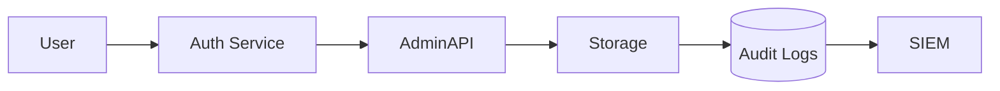

<div class='grid cards' markdown>

-   :material-security:{ .lg .middle } **Security & Compliance**

-   :material-shield-check:{ .lg .middle } **HIPAA Controls**

-   :material-lock_open:{ .lg .middle } **Encryption & Keys**

</div>

!!! warning "Critical"
    Security controls are mandatory for all deployments. PHI/PII handling requires encryption, audit, and RBAC.

!!! note "Policy Note"
    Use org-approved KMS and secrets storage for production keys. Local dev may use file-backed keys only for testing.

!!! tip "Operational Tip"
    Rotate service tokens and keys regularly; automate rotation when possible.

## High-level policies

| Domain | Requirement | Notes |
|--------|-------------|-------|
| Encryption | AES-256 at rest, TLS in transit | KMS preferred |
| Audit | 7-year retention | Immutable logs where possible |
| Access Control | RBAC, least privilege | Scopes for services |
| Monitoring | Alerts on anomalies | Integrate SIEM |



## Key controls

- Encryption at rest and in transit
- Key management via KMS
- Immutable audit logs with retention
- Regular security scans and vulnerability management

### Example: enforcing encryption on storage writes

=== "Python"
    ```python
    # (1) Example: attach KMS key metadata on store requests
    payload = {"key":"patient/1/record.json","kms_key":"arn:aws:kms:...","data":"..."}
    requests.post('https://localhost:8443/api/v1/storage/objects', json=payload)
    ```

=== "Node.js"
    ```javascript
    // (1) Include kms_key in metadata when uploading
    const payload = { key: 'patient/1/record.json', kms_key: 'arn:aws:kms:...', data: '...' }
    fetch('https://localhost:8443/api/v1/storage/objects', { method: 'POST', body: JSON.stringify(payload) })
    ```

=== "curl"
    ```bash
    # (1) cURL include kms
    curl -X POST -H "Content-Type: application/json" -d '{"key":"patient/1/record.json","kms_key":"arn:aws:kms:...","data":"..."}' https://localhost:8443/api/v1/storage/objects
    ```

1. Attach KMS key metadata to ensure encryption policy compliance

??? note "Breach Response"
    Maintain an incident response plan and a chain-of-custody for forensic preservation. Notify stakeholders per legal requirements.

!!! danger "Critical"
    If a key is suspected compromised, rotate immediately and initiate the breach response playbook.
