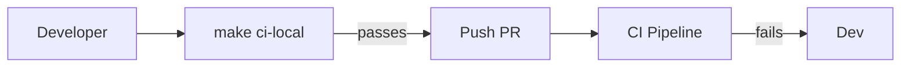

<div class='grid cards' markdown>

-   :material-alert-circle:{ .lg .middle } **Troubleshooting**
    
    ---
    Common failure modes and recovery steps

-   :material-bug-report:{ .lg .middle } **Diagnostics**
    
    ---
    Logs, audit traces, and health checks

-   :material-speed:{ .lg .middle } **Recovery Playbooks**
    
    ---
    Step-by-step actions for incident response

</div>

!!! warning "Logs Contain PHI"
    Treat logs as sensitive. Redact or restrict access when analyzing failures involving PHI.

!!! note "Start with Health Endpoint"
    Always check the unified /health endpoint to determine which service is degraded.

!!! tip "Run Local CI Parity"
    Mirror CI locally with ++make ci-local++ to reproduce issues seen in CI.

## Common Issues

| Symptom | Likely Cause | Remediation |
|---------|--------------|-------------|
| Tests failing on my machine | Dependency/version mismatch | Run local CI parity (Getting Started) |
| UI routes 404 | Missing SPA build or incorrect mount | Run make ui-ci-local or verify admin UI routes |
| Messages not delivered | Filter misconfiguration | Inspect filter rules and audit logs |


## Debugging Steps

1. Check health: ++curl -s https://localhost:8443/health++
2. Review service logs for errors
3. Inspect audit events for related actions

=== "Python"
    ```python
    # (1) Check health and logs aggregation
    import requests
    h = requests.get('https://localhost:8443/health').json()
    print(h)
    ```

=== "Node.js"
    ```javascript
    // (1) Fetch health
    const fetch = require('node-fetch')
    fetch('https://localhost:8443/health').then(r=>r.json()).then(console.log)
    ```

=== "curl"
    ```bash
    # (1) Health via curl
    curl -sS https://localhost:8443/health | jq
    ```

1. The health endpoint returns per-service status for quick triage


## Specific Scenarios

### CI Failing with Mypy/Flake8

- Confirm exact versions of tools via Getting Started preflight
- Ensure sqlalchemy is installed for mypy plugin

### Admin UI Missing Components

- Ensure tsc --noEmit passes in admin UI build
- Check that components are committed (git ls-files vs import analysis)





??? note "Escalation"
    If you cannot resolve a HIPAA-impacting incident, escalate immediately to the compliance team and preserve all logs and snapshots.
