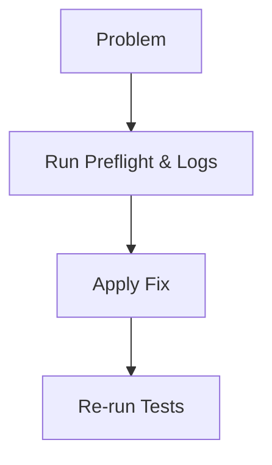

<div class='grid cards' markdown>

-   :material-alert-circle:{ .lg .middle } **Troubleshooting**

-   :material-search:{ .lg .middle } **Diagnostics**

-   :material-bug_report:{ .lg .middle } **Failure Modes**

</div>

!!! note "Start Here"
    Always run local CI parity (`make ci-local`) before debugging a failing PR.

!!! tip "Debugging Tip"
    Use the Admin Console storage browser and messaging DLQ to inspect failed artifacts.

!!! danger "Security Warning"
    Do not copy PHI into public issue trackers. Use anonymized reproductions or controlled uploads to secure logs.

## Common issues & resolutions

| Symptom | Likely cause | Action |
|--------|--------------|--------|
| CI failures on push | Local preflight not run | Run pinned toolchain locally |
| Missing UI routes | tsc --noEmit catches missing imports | Ensure all components are committed |
| mypy errors | Optional defaults typed incorrectly | Use `T | None` or Optional[T] |



### Lint/type/test troubleshooting

=== "Python"
    ```python
    # (1) Run the exact commands CI runs
    black --check core/ || (echo "Run: black core/" && exit 1)
    flake8 core/
    mypy --config-file mypy.ini core/
    PYTHONPATH=$PWD pytest -q
    ```

=== "Node.js"
    ```javascript
    // (1) If Admin UI failing, run in core/admin_ui
    // npm ci && npm run build
    ```

=== "curl"
    ```bash
    # (1) Check API health
    curl -k https://localhost:8443/api/v1/health
    ```

1. Follow the CI parity steps exactly

??? note "Async tests"
    Ensure pytest-asyncio is installed and `@pytest.mark.asyncio` is used for async tests.

## When to open an incident

- Data loss or possible breach
- Persistent CI failures blocking merges across many PRs
- Reproducible data corruption in storage

| Severity | Action |
|----------|--------|
| P0 | Initiate incident response, notify security |
| P1 | Create hotfix branch, run full CI pipeline |

!!! success "Recovery Tip"
    Use message replay and audit logs to reconstruct events after a failure.
