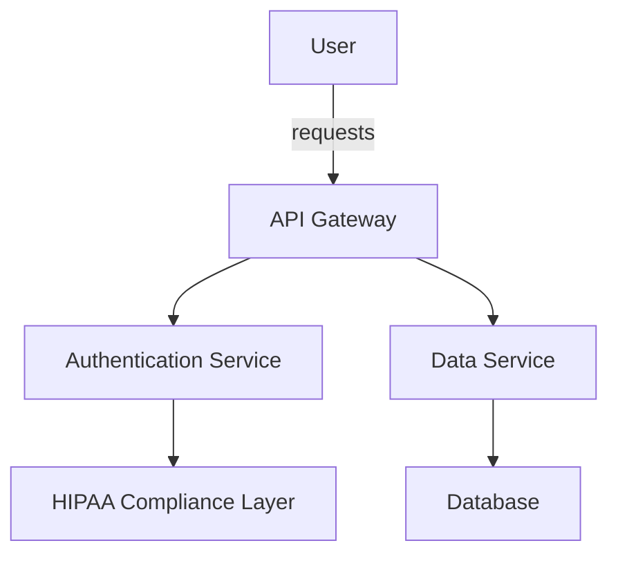

# Getting Started with Vivified Platform

Welcome to the Vivified platform! This guide will help you get up and running with our HIPAA-compliant healthcare platform, designed with a plugin-based architecture and Docker-based deployment.

## Quick Links

<div class="grid cards" markdown>
- :gear: **[Installation Guide](#installation-guide)**  
  Learn how to set up Vivified on your system.
- :computer: **[SDKs](#sdks)**  
  Explore our Python and Node.js SDKs.
- :cloud: **[REST API](#rest-api)**  
  Dive into our API for robust integrations.
- :lock: **[Security](#security)**  
  Understand our HIPAA-compliant architecture.
- :book: **[Documentation](#documentation)**  
  Access all platform resources.
</div>

## Installation Guide

!!! note
    This section will guide you through the basic installation steps for the Vivified platform.

### Prerequisites

- Docker and Docker Compose
- Access to Vivified's private repository

### Step-by-Step Installation

1. **Clone the Repository**

   ```bash
   git clone https://github.com/vivified/vivified-platform.git
   cd vivified-platform
   ```

2. **Start Docker Services**

   ```bash
   docker-compose up -d
   ```

3. **Verify Installation**

   Access the platform at `http://localhost:8000`.

??? info "Advanced Configuration"
    For advanced configuration options, please refer to the [Configuration Table](#configuration-table) below.

## SDKs

Vivified provides SDKs for both Python and Node.js to facilitate easy integration.

=== "Python"
    ```python
    from vivified_sdk import Client

    client = Client(api_key="your_api_key")
    response = client.get_patient_data(patient_id="12345")
    print(response)
    ```

=== "Node.js"
    ```javascript
    const { Client } = require('vivified-sdk');

    const client = new Client('your_api_key');
    client.getPatientData('12345').then(response => {
      console.log(response);
    });
    ```

=== "curl"
    ```bash
    curl -X GET "https://api.vivified.com/patients/12345" -H "Authorization: Bearer your_api_key"
    ```

!!! tip
    Make sure to replace `your_api_key` with your actual API key obtained from the Vivified dashboard.

## REST API

The Vivified REST API provides endpoints for managing healthcare data.

### Authentication

All requests must include an `Authorization` header with a valid API key.

```http
Authorization: Bearer your_api_key
```

## Configuration Table

| Parameter      | Description                       | Default Value |
|----------------|-----------------------------------|---------------|
| `API_PORT`     | Port for API server               | `8000`        |
| `DB_HOST`      | Database host address             | `localhost`   |
| `DB_PORT`      | Database port                     | `5432`        |
| `LOG_LEVEL`    | Level of logging (info, debug)    | `info`        |

## Architecture

Below is a visual representation of Vivified's architecture.



!!! warning
    Ensure all components are properly configured to maintain HIPAA compliance.

## Security

Vivified is designed with security at its core, ensuring all data handling complies with HIPAA regulations.

!!! danger
    Unauthorized access to healthcare data is strictly prohibited and could lead to severe penalties.

??? note "Further Reading"
    For more details on our security measures, visit our [Security Documentation](#).

## Documentation

For more detailed information, visit the [Vivified Documentation](https://docs.vivified.com).

With this guide, you should be well-equipped to start using the Vivified platform. If you encounter any issues, please reach out to our support team. Happy coding!