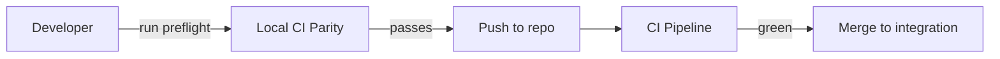

<div class='grid cards' markdown>

-   :material-rocket:{ .lg .middle } **Quick Start**

    ---

    Get up and running with Vivified in minutes — Local CI, Admin Console, and Plugin onboarding

-   :material-account-circle:{ .lg .middle } **Admin First**

    ---

    All features accessible from the Admin Console; accessibility-first UI

-   :material-automatic:{ .lg .middle } **CI Parity**

    ---

    Run exactly what CI runs locally to avoid surprise failures

</div>

!!! tip 'Best Practice'
    Always run the Local CI Parity preflight before pushing. Use Python 3.11 and the pinned tool versions to match CI.

!!! note 'Getting Started Overview'
    This guide walks you through local preflight, Admin Console access, first plugin, and common developer checks. It's dyslexia-friendly with clear sections and visual cues.

!!! warning 'Admin Console Mandate'
    No CLI-only features: every capability must be available from the Admin Console.

## Table of contents

- ## Local CI Parity
- ## Admin Console Access
- ## First Plugin: Install & Register
- ## Quick Debugging Checklist

## Local CI Parity

!!! info 'Why this matters'
    CI mirrors exact tool versions; mismatches lead to noisy CI failures. The preflight ensures parity.

<div class='grid cards' markdown>

-   :material-shield-check:{ .lg .middle } **Reproducible Environment**

    ---

    Python 3.11 virtualenv + pinned deps

-   :material-check-circle:{ .lg .middle } **Pre-commit Hooks**

    ---

    pre-commit runs black, flake8, mypy, and pytest on push

</div>

### Run the preflight (local CI parity)

=== "Python"
    ```python
    # (1)
    # Create and activate Python 3.11 venv, install exact deps
    import subprocess
    subprocess.run(["python3.11", "-m", "venv", ".venv"])
    # (2)
    # Activate and install pinned packages
    # This is illustrative; use the bash variant below for exact commands
    ```

=== "Node.js"
    ```javascript
    // (1)
    // This is a placeholder: UI build uses npm ci && npm run build in UI folders
    // (2) Use make ui-ci-local to run optional UI parity
    console.log('Run UI build in core/ui and core/admin_ui when node is present');
    ```

=== "curl"
    ```bash
    # (1) Exact preflight commands (run from repo root)
    python3.11 -m venv .venv && . .venv/bin/activate
    pip install -r core/requirements.txt \
      black==25.9.0 flake8==7.3.0 mypy==1.18.2 sqlalchemy==2.0.23 \
      pytest pytest-cov pytest-asyncio

    # (2) Lint/type/test
    black --check core/ || (echo 'Run: black core/' && exit 1)
    flake8 core/
    mypy --config-file mypy.ini core/
    PYTHONPATH=$PWD pytest -q
    ```

1. Create an environment exactly like CI
2. Install pinned tools and run checks locally

??? note 'Pre-commit setup'
    To install recommended pre-commit hooks, run the block below in your repo root. This ensures consistent linting and testing on push.

=== "Python"
    ```python
    # (1)
    # Use pip to install pre-commit and write the YAML as shown
    ```

=== "Node.js"
    ```javascript
    // (1)
    // Node-based UI parity is optional but recommended. Add 'ui-ci-local' to Makefile.
    ```

=== "curl"
    ```bash
    pip install pre-commit
    cat > .pre-commit-config.yaml <<'YAML'
    repos:
      - repo: https://github.com/psf/black
        rev: 25.9.0
        hooks: [{ id: black }]
      - repo: https://github.com/PyCQA/flake8
        rev: 7.3.0
        hooks: [{ id: flake8 }]
      - repo: https://github.com/pre-commit/mirrors-mypy
        rev: v1.18.2
        hooks:
          - id: mypy
            additional_dependencies: ["sqlalchemy==2.0.23"]
      - repo: local
        hooks:
          - id: pytest
            name: pytest (pre-push)
            entry: bash -c 'PYTHONPATH=$PWD pytest -q'
            language: system
            pass_filenames: false
            stages: [push]
    YAML
    pre-commit install -t pre-commit -t pre-push
    ```

## Admin Console Access

!!! tip 'Primary Interface'
    The Admin Console is the primary UI for managing the platform. All features are accessible through the web interface.

| Area | Description | Access |
|------|-------------|--------|
| Dashboard | System health, metrics, quick actions | Admin role |
| Plugins | Marketplace, register/unregister plugins | Admin role |
| Settings | Global config & environment variables | Admin role |

### Keyboard shortcuts (examples)

- ++ctrl+k++ to open command palette
- ++ctrl+s++ to save changes in forms

??? note 'UI Build'
    If your push includes UI code, the CI will run a separate Docker UI build job. Ensure local builds pass with ++make ui-ci-local++ when possible.

## First Plugin: Install & Register

!!! info 'Plugin model'
    Plugins are first-class: they expose roles, Admin UI components, and configuration. Use the Plugin Marketplace in the Admin Console to register a new plugin.

<div class='grid cards' markdown>

-   :material-puzzle:{ .lg .middle } **Plugin Extensibility**

    ---

    Plugins can provide canonical adapters, event handlers, and UI widgets

-   :material-widgets:{ .lg .middle } **Marketplace**

    ---

    Install or register plugins via the Admin Console or API

</div>

### Quick register via Admin API

=== "Python"
    ```python
    # (1)
    import requests
    resp = requests.post('https://admin.example/api/plugins', json={'name': 'my-plugin'})
    # (2)
    print(resp.status_code)
    ```

=== "Node.js"
    ```javascript
    // (1)
    const fetch = require('node-fetch')
    // (2)
    fetch('https://admin.example/api/plugins', { method: 'POST', body: JSON.stringify({ name: 'my-plugin' }) })
    ```

=== "curl"
    ```bash
    # (1)
    curl -X POST https://admin.example/api/plugins -H 'Content-Type: application/json' -d '{"name":"my-plugin"}'
    ```

1. Use the Admin API to register plugins programmatically
2. Prefer the Admin Console for guided workflows and verification

## Quick Debugging Checklist

- [x] Run ++make ci-local++ or preflight commands
- [x] Build Admin UI locally (++make ui-ci-local++) when changing UI
- [ ] Ensure branch protection checks are green before merge



!!! danger 'Merge protection'
    Do not merge if local parity fails. Agents and automation rely on green main/integration branches.

??? note 'Advanced'
    For agent gating and advanced automation (poll PR merge or wait-merge), see the Admin API and tools/scripts in the repo.

[^1]: Local CI parity is required to prevent CI-only failures.
