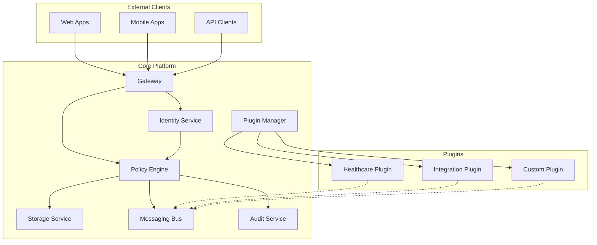

# Welcome to Vivified Platform

<div class="hipaa-badge">HIPAA Compliant</div>

## Enterprise-Grade Healthcare Platform

Vivified is a **modular, HIPAA-compliant platform** designed for building secure healthcare applications. Built with security-first architecture and comprehensive audit capabilities, Vivified provides the foundation for modern healthcare solutions.

!!! success "Production Ready"
    Vivified is actively processing Protected Health Information (PHI) in production environments with Business Associate Agreements (BAAs) in place.

## :material-rocket: Quick Start

Get started with Vivified in just a few minutes:

=== "Docker"

    ```bash
    # Clone the repository
    git clone https://github.com/DMontgomery40/vivified.git
    cd vivified

    # Start the platform
    docker-compose up -d

    # Access the Admin Console
    open http://localhost:8080
    ```

=== "Kubernetes"

    ```bash
    # Apply the manifests
    kubectl apply -f k8s/

    # Wait for services to be ready
    kubectl wait --for=condition=ready pod -l app=vivified-core

    # Port-forward to access locally
    kubectl port-forward svc/vivified-gateway 8080:8080
    ```

=== "Development Mode"

    ```bash
    # Set up development environment
    export DEV_MODE=true
    make dev-setup

    # Start with hot-reload
    make dev-run

    # Admin Console (no auth required in dev mode)
    open http://localhost:8080
    ```

## :material-shield-check: Key Features

<div class="feature-grid">
  <div class="feature-card">
    <h3>🔐 Security First</h3>
    <p>Zero-trust architecture with comprehensive audit trails, encryption at rest and in transit, and HIPAA-compliant data handling.</p>
  </div>
  
  <div class="feature-card">
    <h3>🧩 Modular Design</h3>
    <p>Plugin-based architecture allows extending functionality without modifying core platform code.</p>
  </div>
  
  <div class="feature-card">
    <h3>🎛️ Admin Console</h3>
    <p>Full-featured web interface for configuration, monitoring, and management - no CLI required.</p>
  </div>
  
  <div class="feature-card">
    <h3>📊 Three-Lane Communication</h3>
    <p>Structured inter-plugin communication via Canonical (events), Operator (RPC), and Proxy (external) lanes.</p>
  </div>
</div>

## :material-architecture: Platform Architecture



## :material-hospital: HIPAA Compliance

!!! warning "PHI Handling Requirements"
    All components handling Protected Health Information must:
    
    - ✅ Tag data with appropriate classification
    - ✅ Use core storage service for persistence
    - ✅ Log all access via audit service
    - ✅ Implement encryption at rest and in transit
    - ✅ Follow minimum necessary access principles

### Compliance Features

| Control | Implementation | Status |
|---------|---------------|---------|
| Access Control | Role-based with trait system | ✅ Active |
| Encryption | AES-256 at rest, TLS 1.3 in transit | ✅ Active |
| Audit Logging | Comprehensive with 7-year retention | ✅ Active |
| Data Integrity | Checksums and version control | ✅ Active |
| Transmission Security | Encrypted channels only | ✅ Active |

## :material-code-tags: Development

### Plugin SDK Support

=== "Python"

    ```python
    from vivified import Plugin, canonical, operator
    
    class HealthcarePlugin(Plugin):
        """Example healthcare plugin"""
        
        @canonical.subscribe("patient.created")
        async def handle_patient(self, event):
            # Process patient event
            patient_data = event.data
            await self.storage.save("patients", patient_data)
            
        @operator.expose("get_patient")
        async def get_patient(self, patient_id: str):
            return await self.storage.get("patients", patient_id)
    ```

=== "Node.js"

    ```javascript
    import { Plugin, canonical, operator } from '@vivified/sdk';
    
    class HealthcarePlugin extends Plugin {
      constructor() {
        super('healthcare-plugin');
      }
      
      @canonical.subscribe('patient.created')
      async handlePatient(event) {
        // Process patient event
        const patientData = event.data;
        await this.storage.save('patients', patientData);
      }
      
      @operator.expose('getPatient')
      async getPatient(patientId) {
        return await this.storage.get('patients', patientId);
      }
    }
    ```

### API Examples

??? example "REST API - Create User"

    <span class="api-endpoint post">POST</span> `/api/v1/users`
    
    ```json
    {
      "email": "doctor@hospital.org",
      "name": "Dr. Smith",
      "roles": ["physician"],
      "traits": ["can_view_patients", "can_prescribe"]
    }
    ```
    
    **Response:**
    ```json
    {
      "id": "usr_abc123",
      "email": "doctor@hospital.org",
      "name": "Dr. Smith",
      "roles": ["physician"],
      "traits": ["can_view_patients", "can_prescribe"],
      "created_at": "2024-01-15T10:30:00Z"
    }
    ```

??? example "WebSocket - Subscribe to Events"

    ```javascript
    const ws = new WebSocket('wss://api.vivified.dev/ws');
    
    ws.on('open', () => {
      ws.send(JSON.stringify({
        type: 'subscribe',
        channels: ['patient.updates', 'audit.logs']
      }));
    });
    
    ws.on('message', (data) => {
      const event = JSON.parse(data);
      console.log('Received event:', event);
    });
    ```

## :material-book-open-variant: Learn More

!!! tip "Getting Started Guide"
    New to Vivified? Check out our [Getting Started Guide](getting-started.md) for a comprehensive walkthrough.

<div class="grid cards" markdown>

-   :material-rocket-launch:{ .lg .middle } **Quick Start**

    ---

    Get up and running in minutes with our quick start guide

    [:octicons-arrow-right-24: Quick Start](getting-started.md)

-   :material-puzzle:{ .lg .middle } **Plugin Development**

    ---

    Learn how to build custom plugins for your specific needs

    [:octicons-arrow-right-24: Plugin Guide](plugins/index.md)

-   :material-api:{ .lg .middle } **API Reference**

    ---

    Complete API documentation with examples

    [:octicons-arrow-right-24: API Docs](api/rest.md)

-   :material-shield-check:{ .lg .middle } **Security Guide**

    ---

    Security best practices and compliance information

    [:octicons-arrow-right-24: Security](security/index.md)

</div>

## :material-help-circle: Support

- 📧 **Email**: support@vivified.dev
- 💬 **Discord**: [Join our community](https://discord.gg/vivified)
- 🐛 **Issues**: [GitHub Issues](https://github.com/DMontgomery40/vivified/issues)
- 📚 **Docs**: [docs.vivified.dev](https://docs.vivified.dev)

---

<p align="center">
  <small>
    Made with ❤️ for the healthcare community |
    Licensed under MIT |
    <a href="https://github.com/DMontgomery40/vivified">GitHub</a>
  </small>
</p>