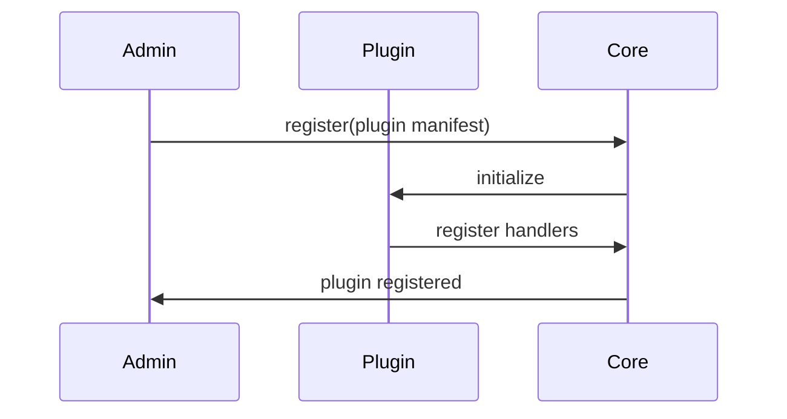

<div class='grid cards' markdown>

-   :material-widgets:{ .lg .middle } **Plugin Development**

    ---

    How to build, register, and test plugins for Vivified

-   :material-extension:{ .lg .middle } **Plugin API**

    ---

    Plugin lifecycle, registration, and capabilities

-   :material-publish:{ .lg .middle } **Marketplace Ready**

    ---

    Packaging and publishing guidelines for the Admin Console marketplace

</div>

!!! tip 'Start with canonical models'
    Use canonical types when designing plugin inputs/outputs to ensure compatibility with other plugins and core services.

!!! note 'Admin Console integration'
    Every plugin must expose administrative UI components when applicable; no CLI-only features.

!!! warning 'Security review required'
    Plugins that access PHI require additional security review and must declare required roles and capabilities.

## Plugin anatomy

- manifest.yaml — metadata and capabilities
- server/ — plugin runtime (Python/Node)
- ui/ — optional Admin UI components
- tests/ — unit and integration tests

### Manifest example (conceptual)

| Field | Purpose | Example | Required |
|-------|---------|---------|----------|
| name | Plugin name | my-plugin | yes |
| version | Semver | 1.0.0 | yes |
| capabilities | Roles and hooks | canonical-adapter | recommended |
| ui | Admin UI entry points | /admin/plugins/my-plugin | recommended |

### Lifecycle



### Example: plugin registration via API

=== "Python"
    ```python
    # (1)
    import requests
    resp = requests.post('https://admin.example/api/plugins', json={'name': 'my-plugin', 'version':'1.0.0'})
    print(resp.json())
    ```

=== "Node.js"
    ```javascript
    // (1)
    const fetch = require('node-fetch')
    await fetch('https://admin.example/api/plugins', { method: 'POST', body: JSON.stringify({ name: 'my-plugin', version: '1.0.0' }) })
    ```

=== "curl"
    ```bash
    # (1)
    curl -X POST https://admin.example/api/plugins -H 'Content-Type: application/json' -d '{"name":"my-plugin","version":"1.0.0"}'
    ```

1. Register a plugin manifest with the Admin API; plugin will be initialized and provided with secrets

## Development checklist

- [x] Implement canonical adapters if exchanging user/message data
- [x] Provide Admin UI components for configuration
- [x] Add unit and async tests (++pytest++ for Python)
- [ ] Submit security review for PHI access

??? note 'Testing'
    Use in-memory SQLite for tests and avoid network/DB calls at import time. Mark async tests with ++@pytest.mark.asyncio++.

## Packaging & Marketplace

| Item | Description | Required |
|------|-------------|----------|
| manifest.yaml | Plugin metadata | yes |
| signed package | Optional for marketplace | recommended |
| UI bundle | Admin UI assets (if present) | recommended |

!!! danger 'Unsigned plugins'
    Do not install unsigned plugins in production without an explicit security review.

[^1]: Plugins must adhere to Admin Console accessibility and provide keyboard-navigable UI components.
