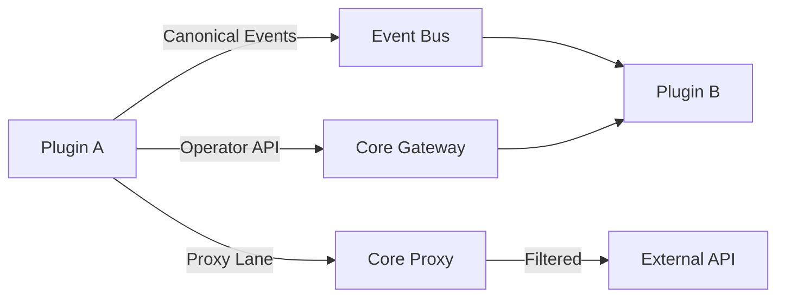
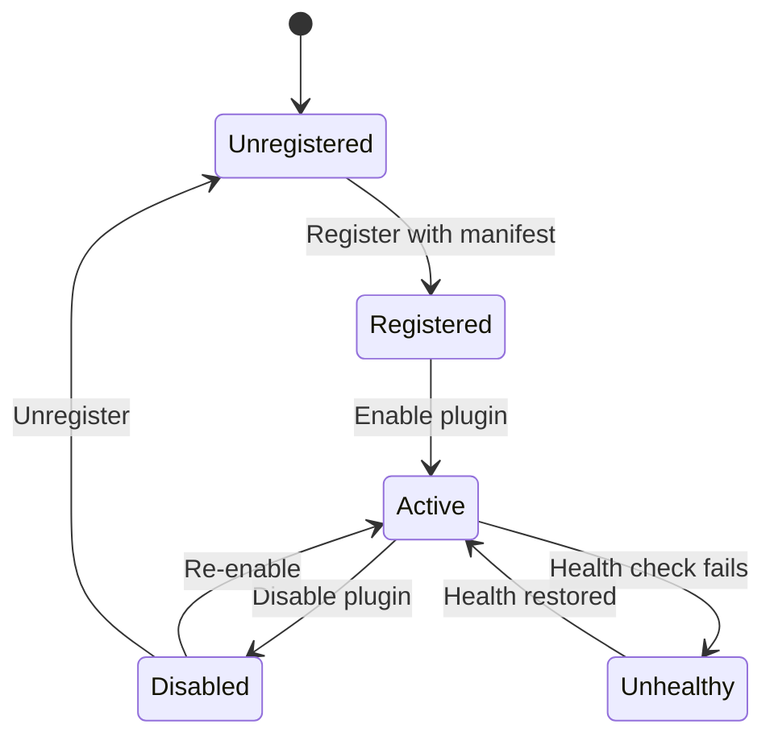

# Plugins Overview

The Vivified platform is built on a powerful plugin architecture that enables modular, extensible functionality while maintaining security and HIPAA compliance. Plugins are the primary way to extend and customize the platform.

<div class='grid cards' markdown>

-   :material-puzzle:{ .lg .middle } **Modular Architecture**
    
    ---
    Isolated microservices communicate through well-defined APIs

-   :material-security:{ .lg .middle } **Secure by Default**
    
    ---
    Sandboxed execution with policy-based access control

-   :material-code-tags:{ .lg .middle } **Polyglot Support**
    
    ---
    Build plugins in Python, Node.js, Go, or any language

</div>

## What are Plugins?

Plugins are containerized microservices that add features to Vivified without modifying core code. Each plugin:

- **Runs in isolation** - Containerized with resource limits
- **Communicates through APIs** - REST or gRPC interfaces  
- **Follows security policies** - Enforced by the core platform
- **Integrates with Admin UI** - Provides web-based management

## Plugin Categories

| Category | Purpose | Examples |
|----------|---------|----------|
| **Storage** | Data persistence and retrieval | S3 adapter, PostgreSQL connector |
| **Communication** | Messaging and notifications | Email sender, SMS gateway, Slack |
| **Identity** | User management and authentication | LDAP, OAuth2, SAML |
| **Processing** | Data transformation and analysis | OCR engine, ML models, ETL |
| **Integration** | External system connectors | EHR systems, billing platforms |

## Three-Lane Communication Model

All plugin interactions follow one of three supervised communication patterns:



### 1. Canonical Lane
- **Purpose**: Asynchronous event-driven communication
- **Format**: Normalized canonical data models
- **Example**: User created, document processed, payment received

### 2. Operator Lane  
- **Purpose**: Synchronous API calls between plugins
- **Format**: REST/gRPC with authentication
- **Example**: Fetch user details, validate configuration

### 3. Proxy Lane
- **Purpose**: Controlled external API access
- **Format**: HTTP/HTTPS with domain allowlisting
- **Example**: Call third-party services, webhooks

## Plugin Lifecycle



## Getting Started

### Quick Start

1. **Browse Available Plugins**
   - Visit Admin Console → Plugins → Marketplace
   - Filter by category, traits, or capabilities

2. **Install a Plugin**
   - Click "Install" on desired plugin
   - Configure required settings
   - Enable and verify health status

3. **Build Your Own**
   - See [Development Guide](development.md) for detailed instructions
   - Use SDK for your preferred language: [Python](sdk.md#python), [Node.js](sdk.md#nodejs), [Go](sdk.md#go)
   - Follow the [Plugin Examples](examples.md)

### Plugin Manifest

Every plugin requires a manifest declaring its capabilities and requirements:

```json
{
  "id": "my-plugin",
  "name": "My Plugin", 
  "version": "1.0.0",
  "contracts": ["StoragePlugin"],
  "traits": ["handles_pii", "audit_required"],
  "security": {
    "authentication_required": true,
    "data_classification": ["pii"]
  },
  "allowed_domains": ["api.example.com"]
}
```

## Security & Compliance

### Security Requirements

!!! warning "Security Mandatory"
    All plugins MUST implement authentication and declare data classification

- **Authentication**: Required for all plugin endpoints
- **Authorization**: Role-based access control via traits
- **Audit Logging**: Automatic for sensitive operations
- **Data Classification**: Must declare PII/PHI handling

### HIPAA Compliance

For healthcare deployments, plugins handling PHI must:

- Declare `handles_phi` trait
- Implement required HIPAA controls
- Support 7-year audit retention
- Encrypt data at rest and in transit

## Plugin Management

### Admin Console Features

| Feature | Description | Access Required |
|---------|-------------|-----------------|
| **Browse Marketplace** | View available plugins | `admin` |
| **Install/Uninstall** | Manage plugin lifecycle | `plugin_manager` |
| **Configure** | Edit plugin settings | `config_manager` |
| **Monitor Health** | View status and metrics | `admin` |
| **View Audit Logs** | Track plugin actions | `audit_viewer` |

### CLI Management

```bash
# List installed plugins
vivified plugins list

# Install from marketplace
vivified plugins install <plugin-id>

# Configure plugin
vivified plugins config <plugin-id> --set key=value

# Check plugin health
vivified plugins health <plugin-id>
```

## Available Plugins

### Core Plugins

- **[LLM OSS Plugin](llm-oss.md)** - Local language model integration
- **[RAG Database Plugin](rag-db-plugin.md)** - Vector database for retrieval-augmented generation

### Community Plugins

Browse the [Plugin Marketplace](https://plugins.vivified.dev) for community-contributed plugins.

## Best Practices

!!! tip "Plugin Development Tips"
    1. Start with the SDK for your language
    2. Follow the principle of least privilege
    3. Implement comprehensive health checks
    4. Provide Admin UI components when applicable
    5. Document all configuration options

## Next Steps

- **Developers**: Read the [Plugin Development Guide](development.md)
- **Administrators**: Explore the [Plugin System](plugin-system.md) architecture
- **Examples**: Review [Plugin Examples](examples.md) for common patterns