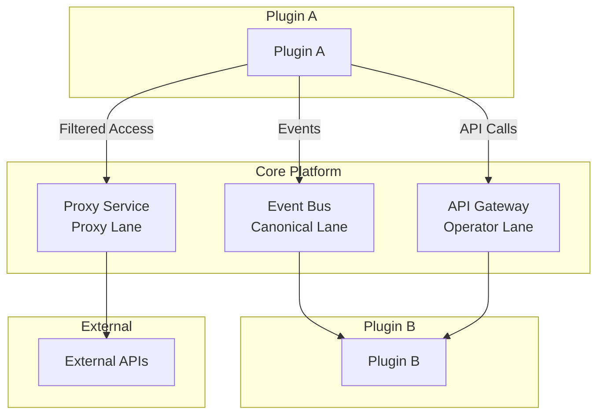

# Plugin System Architecture

The Vivified platform is built on a sophisticated plugin architecture that enables secure, modular extensibility while maintaining HIPAA compliance and enterprise-grade security.

<div class='grid cards' markdown>

-   :material-puzzle:{ .lg .middle } **Modular Design**
    
    ---
    Isolated microservices with well-defined contracts

-   :material-security:{ .lg .middle } **Security First**
    
    ---
    Sandboxed execution with comprehensive validation

-   :material-lan-connect:{ .lg .middle } **Three-Lane Communication**
    
    ---
    Canonical events, operator APIs, and controlled proxy access

</div>

## What Are Plugins?

Vivified plugins are **containerized microservices** that extend platform functionality without modifying core code. Each plugin operates in complete isolation, communicating through well-defined interfaces.

### Key Benefits

<div class='grid cards' markdown>

-   :material-plus-circle:{ .lg .middle } **Extensibility**
    
    ---
    Add features without changing core code

-   :material-shield-lock:{ .lg .middle } **Isolation & Security**
    
    ---
    Sandboxed execution prevents cascading failures

-   :material-code-tags:{ .lg .middle } **Polyglot Development**
    
    ---
    Build in Python, Node.js, Go, or any language

-   :material-view-module:{ .lg .middle } **Modularity**
    
    ---
    Deploy only the plugins you need

</div>

!!! tip "Plugin-First Architecture"
    Even core capabilities like identity management and notifications are implemented as plugins, making the platform extremely flexible.

## Communication Architecture

All plugin communication flows through the Vivified core, ensuring consistent security policy enforcement.

### Three-Lane Model



#### 1. Canonical Event Lane

**Purpose**: Asynchronous, decoupled communication via normalized events

=== "Event Publishing"
    ```json
    {
      "event_type": "user.created",
      "data": {
        "user_id": "123",
        "email": "user@example.com",
        "created_at": "2025-01-01T00:00:00Z"
      },
      "metadata": {
        "source": "identity-service",
        "classification": "pii"
      }
    }
    ```

=== "Event Subscription"
    ```python
    @plugin.on_event("user.created")
    async def handle_user_created(event):
        # Set up user workspace
        await create_user_workspace(event.data.user_id)
    ```

!!! example "Use Cases"
    - HR plugin emits `UserCreated` → Accounting plugin sets up payroll
    - Document plugin emits `DocumentProcessed` → Notification plugin sends alerts
    - Payment plugin emits `PaymentReceived` → Billing plugin updates records

#### 2. Operator API Lane

**Purpose**: Synchronous request/response between plugins

=== "API Call"
    ```python
    # Get user details from identity service
    response = await plugin.call_operator(
        target="identity-service",
        method="GET",
        path="/users/123"
    )
    user_data = response.json()
    ```

=== "Policy Enforcement"
    ```yaml
    # Core validates before forwarding
    - caller_traits: ["user_manager"]
    - target_endpoint: "/users/{id}"
    - required_permissions: ["read_user"]
    ```

!!! warning "Security Governance"
    The core's policy engine validates every operator call, checking plugin traits and user permissions before forwarding requests.

#### 3. Proxy Lane

**Purpose**: Controlled external API access with domain allowlisting

=== "External API Call"
    ```python
    # Call external service through proxy
    response = await plugin.proxy_request(
        url="https://api.example.com/data",
        method="GET",
        headers={"API-Key": "secret"}
    )
    ```

=== "Domain Allowlist"
    ```json
    {
      "allowed_domains": [
        "api.salesforce.com",
        "hooks.slack.com",
        "api.stripe.com"
      ]
    }
    ```

!!! danger "Restricted Access"
    Only plugins with `external_service` trait can use the proxy lane. All calls are logged and filtered through domain allowlists.

## Plugin Manifest System

Every plugin declares its capabilities through a comprehensive manifest that undergoes strict security validation.

### Core Manifest Structure

```json
{
  "id": "user-management",
  "name": "User Management Service",
  "version": "1.2.0",
  "description": "Manages user profiles and authentication",
  "contracts": ["IdentityPlugin"],
  "traits": ["handles_pii", "audit_required"],
  "security": {
    "authentication_required": true,
    "data_classification": ["pii"]
  },
  "compliance": {
    "hipaa_controls": ["164.312(a)"],
    "audit_level": "detailed"
  }
}
```

### Manifest Fields Reference

- id – A unique identifier for the plugin. This is a short string (only lowercase letters, numbers, or hyphens are allowed) GitHub. It’s used as the plugin’s key in the system (e.g., other plugins might refer to this ID if they depend on it). Example: `"user-management"` is the ID of the User Management plugin GitHub.
- name – Human-readable name of the plugin. Can include spaces or mixed case. This is for display purposes (e.g., in UIs or logs) and can be more descriptive than the ID.
- version – The plugin’s version string, following semantic versioning (MAJOR.MINOR.PATCH) GitHub. This helps manage compatibility and upgrades. Example: `"1.0.0"` for a stable initial release GitHub.
- description – A short description of what the plugin does. This field may be optional in the manifest schema, but it’s highly recommended to include it for clarity. For example: `"Manages user profiles and extended attributes"` GitHub.
- contracts – A list of interface contracts the plugin implements. Contracts define the type of plugin in terms of functionality. Vivified defines several standard plugin interfaces, such as:
  - `"IdentityPlugin"` for plugins that manage user identities (accounts, profiles, authentication data) – e.g. a User Management plugin would use this.
  - `"CommunicationPlugin"` for plugins that handle messaging or notifications (e.g. email/SMS sender, chat integrations). Such plugins would implement methods like `send_message` and `receive_messages` GitHub.
  - `"StoragePlugin"` for plugins that provide data storage capabilities (e.g. file storage, database connectors), implementing methods like `store`, `retrieve`, `delete` GitHub.

  By declaring a contract, a plugin tells the core (and other plugins) what general role it plays. The manifest can list multiple contracts if applicable. For instance, a plugin might serve both as an Identity provider and a Communication provider, implementing both interfaces. The platform may enforce certain expectations based on contracts – e.g., if you claim to be an `IdentityPlugin`, you should provide certain API endpoints or behaviors. (Currently, valid contract names are limited to the known interface classes: `CommunicationPlugin`, `StoragePlugin`, `IdentityPlugin` GitHub.)

- traits – A list of traits that describe the plugin’s capabilities, security posture, and requirements. Traits are essentially flags or labels that inform the core’s policy engine and UI about what the plugin can do or needs. Some examples:
  - `"handles_pii"` – The plugin handles Personally Identifiable Information.
  - `"handles_phi"` – The plugin handles Protected Health Information (health data under HIPAA).
  - `"audit_required"` – All actions by this plugin must be audited (logged in detail).
  - `"external_service"` – The plugin connects to external services or APIs.

  (There are many possible traits; the platform has a registry of them covering roles, capabilities, data sensitivity, compliance needs, etc. GitHub GitHub)

  Every plugin is required to have at least one trait GitHub, and certain trait combinations are enforced. For example, if a plugin declares it `"handles_pii"`, it is expected to also include `"audit_required"` (the system requires audit logs for any plugin processing PII) GitHub GitHub. Likewise, a plugin with `"handles_phi"` (health data) must have `"phi"` in its data classification (explained below) and provide HIPAA controls (explained under compliance) GitHub GitHub. Some traits may be forbidden for security reasons – e.g., traits like `"admin"`, `"system"`, or `"root"` are reserved or considered dangerous and will be rejected if a plugin tries to register with them GitHub. Essentially, traits paint a picture of the plugin’s profile, which the platform uses to make security decisions and to present info in the UI (each trait can have a user-friendly label and icon).

- dependencies – A list of other plugin IDs that this plugin depends on. If your plugin needs another plugin to be present (for example, an “HR Onboarding” plugin might depend on an `"identity-service"` plugin for creating user accounts, or on an `"email-sender"` plugin to send welcome emails), list those plugin IDs here. At registration, Vivified will check these dependencies and can warn or prevent startup if required plugins are missing GitHub. In the manifest, dependencies are just the IDs (strings). They should match exactly the id of the required plugin. (The system may also check for circular dependencies and format validity GitHub.)

- allowed_domains – A list of external domains (hostnames) this plugin is allowed to contact. This is relevant if the plugin needs to call external APIs or services outside the Vivified platform. By default, plugins are assumed not to call external URLs, so this list is usually empty (as in the example plugin) GitHub. If the plugin does need web access, you must list every domain or host it will communicate with (e.g., if a plugin calls an external CRM at `api.salesforce.com`, that domain should appear here). The core will block any outbound call from the plugin that isn’t to an allowed domain GitHub. Additionally, some domains are always blocked for security (e.g. localhost, 127.0.0.1, known malware or phishing domains) – those should not be in allowed list GitHub. The platform also validates domain formats (no wildcards or invalid names) GitHub GitHub. This mechanism is part of the “Proxy Lane” security: if a plugin tries to use the core as a proxy to reach the internet, the core will only permit connections to trusted domains specified here.

- endpoints – A mapping of endpoint names to URL paths that the plugin exposes. This helps the core (and developers/users) know what URLs the plugin is listening on. Common endpoints are a health check or specific API routes. For example, the user management plugin’s manifest includes: `"endpoints": { "health": "/health", "user_info": "/api/users/{id}" }` GitHub. This tells us the plugin serves an HTTP GET at `/health` for health checks, and a GET at `/api/users/{id}` to fetch user info. Endpoints can be RESTful paths, webhook URLs, etc., depending on plugin purpose. In the future, the core’s API gateway might use this info to route requests (for instance, if the core receives an API call for a user profile, it knows to forward it to the plugin providing the `"user_info"` endpoint). For now, endpoints are mainly informational and for conventions – plugins still need to implement and run an API server internally to handle these routes.

- security – An object detailing security-related settings for the plugin. Two fields here are required for all plugins GitHub:
  - authentication_required – A boolean indicating if the plugin’s endpoints require authentication. This must be true for all real plugins in Vivified GitHub. Essentially, plugins should not expose unauthenticated APIs (except maybe health checks). If a plugin set this to false, the core’s validator will reject the registration, because all plugin interactions should be authenticated by design.
  - data_classification – A list of data sensitivity levels that the plugin handles. The allowed values are `"public"`, `"internal"`, `"confidential"`, `"pii"` (Personal Identifiable Info), and `"phi"` (Protected Health Info) GitHub. The plugin developer should choose the highest classification of data the plugin deals with. For example, a plugin that only handles non-sensitive configuration might be `"internal"`, but a plugin managing user profiles would likely include `"pii"`. If `"phi"` or `"pii"` are included, the plugin should also have the corresponding `handles_phi`/`handles_pii` traits as mentioned above, to be consistent. The platform will validate this consistency – e.g., if you claim to handle PHI but don’t classify data as `"phi"`, or vice versa, registration will fail GitHub. Likewise, if a plugin has an `"external_service"` trait, the security section should probably include an `allowed_domains` list (or else the validator will complain that an external-service plugin provided no allowed domains) GitHub.

  The security section can include additional fields as well. For instance, network isolation settings or similar flags could appear (the manifest schema expects at least the two above, but the code also mentions a `network_isolation` flag as something to enforce GitHub). In future, this might indicate if the plugin should run in a stricter sandbox network. For now, focus on auth and data classification which are mandatory. The platform’s security validator will examine this section thoroughly on registration, ensuring these rules are met (authentication must be required; data classification must be provided and valid) GitHub.

- compliance – An object for compliance and regulatory requirements. In the manifest, it requires at least:
  - hipaa_controls – an array of HIPAA control identifiers that the plugin adheres to (if it handles health data) GitHub. These are typically citations of regulations, like `"164.312(a)"` or other HIPAA rule references. If the plugin doesn’t deal with PHI, this can be an empty list or a set of relevant controls for other data types. However, if the plugin has `handles_phi` trait, it must list at least one applicable HIPAA control to show how it complies GitHub. The format of these control strings is validated (they expect a pattern like numbers and subsections) GitHub.
  - audit_level – a string indicating how much auditing is required for this plugin’s operations GitHub. Allowed values are `"none"`, `"basic"`, `"detailed"`, or `"complete"`. This setting tells the core how extensively to log actions involving this plugin. For example, `"basic"` might log only key events, whereas `"detailed"` logs every request/response, and `"complete"` could even include full data dumps for compliance. In practice, a plugin that handles sensitive data would at least be `"detailed"`. The example plugin sets `audit_level: "detailed"` meaning it requires comprehensive audit logs GitHub.

  The compliance section might also include other fields such as data retention requirements. For instance, the platform’s security rules expect that PHI data is retained for a minimum period (7 years, per HIPAA rules) GitHub. If a plugin handles PHI, it should ideally specify a `data_retention_days` in compliance (and the system would enforce a minimum of 2555 days) GitHub. If not specified, a default or separate policy might apply, but it’s good practice to document it. (This particular field wasn’t in the manifest schema we saw GitHub, but the validator code hints at such a check).

- health_check – (Optional) A configuration for health monitoring of the plugin. If provided, the core will automatically start periodically checking the plugin’s health using this info GitHub GitHub. Typically this would be a dictionary specifying how to check health, e.g., `{ "type": "http", "port": 8080, "path": "/health" }` meaning the core should perform an HTTP GET on the plugin’s `/health` endpoint at port 8080. If not specified, the core may simply mark the plugin as “healthy” upon registration and rely on basic heartbeat or manual checks. In our Phase 1 example, the plugin did not include a `health_check` field in manifest (so health monitoring wasn’t auto-started), but it does expose a `/health` endpoint that could be used. The platform’s health monitor supports different types: `"http"` (default), `"tcp"` ping, or `"custom"` checks GitHub. Using HTTP type, it expects an HTTP 200 response from the health endpoint and can even parse JSON to gather metrics like uptime, memory, etc., if the plugin provides them GitHub. If the response is not OK, or times out, the core will mark the plugin as degraded or unhealthy accordingly. This mechanism is important for production environments to detect failing plugins automatically.

- resources – (Optional, advanced) Resource limit specifications for the plugin. This field may not appear in all manifests, but it’s recommended to include if you want to enforce that a plugin does not exceed certain CPU or memory usage. For example, a plugin manifest might have:

```
"resources": {
    "memory_limit": 512,
    "cpu_limit": 1.0
}
```

meaning the plugin container should be limited to 512 MB of RAM and 1 CPU core. The Vivified platform’s validator will check these values if provided. It requires a minimum of 64 MB memory (anything less is considered too low and will be flagged) and allows up to 8192 MB = 8 GB max GitHub. For CPU, it expects at least 0.1 (a tenth of a core) and at most 8.0 cores GitHub. If the values are out of range or not numbers, registration will fail with an error like "Memory limit too low" etc. This ensures that plugins run within reasonable resource bounds and one plugin cannot starve the system of resources. (These limits may be enforced via container runtime settings in deployment.)

As we can see, the manifest is quite comprehensive. The code is the source of truth, and the platform will validate the manifest strictly against these expectations. If any required field is missing or something doesn’t pass validation, the plugin will not be allowed to register. For instance, forgetting to include a `data_classification` or leaving `traits` empty will result in a 400 Bad Request during registration GitHub GitHub. Similarly, using an invalid plugin id (wrong format) or a duplicate id will be rejected GitHub GitHub.

## Security Validation of Manifests

When a plugin registers, Vivified performs comprehensive security checks on the manifest before accepting it. Here are the critical rules enforced:

- Authentication: `security.authentication_required` must be true. The platform does not allow plugins with unauthenticated endpoints GitHub. This is a fundamental rule – all plugin interactions are expected to be within an authenticated context (usually using the token the core issues to the plugin, more on that soon).
- Data Classification: `security.data_classification` must be provided and cannot be empty GitHub. The values in it must be one of the allowed categories (no made-up categories). If a plugin handles sensitive info, it needs to be explicitly classified as such.
- Trait Requirements: The plugin must declare at least one trait GitHub. Certain traits have built-in requirements:
  - If `"handles_phi"` trait is present, the plugin’s data classification must include `"phi"` GitHub and the `compliance.hipaa_controls` list cannot be empty GitHub.
  - If `"handles_pii"` trait is present, data classification must include `"pii"` GitHub.
  - If `"external_service"` trait is present, the plugin’s `security.allowed_domains` list must not be empty (you have to specify which domains it will call) GitHub.

  Traits that are considered dangerous or reserved (like `"admin"`, `"root"`, `"system"`) will cause validation to fail – these traits are not allowed for plugins GitHub (they are meant for internal roles or could imply too much privilege).

  The platform also uses a trait validator to ensure there are no conflicting traits or missing prerequisites. For example, if a plugin has a compliance trait like `"gdpr_compliant"`, it might be required to also have `"handles_pii"` and `"audit_required"` (depending on how traits are defined in the registry) GitHub. These relationships are checked so that the plugin’s trait set is internally consistent.

- Network Security: If the plugin lists `allowed_domains`, each domain is vetted:
  - It cannot be on a blocked list (like localhost or known malicious domains) GitHub.
  - It should not match suspicious patterns (like an IP in a private range, which might indicate an attempt to bypass security) GitHub.
  - It must be a valid domain format (no illegal characters or overly long names, etc.) GitHub GitHub.

- Compliance: If sensitive data traits are present, compliance info must be present. E.g., PHI -> require HIPAA controls, as noted. Also if there’s a policy that PHI data needs a certain retention, the manifest should reflect that (or the platform may enforce it automatically).
- Resource Limits: While optional, if provided, they are checked for sane values as described above (not too low or too high) GitHub GitHub. This prevents misconfiguration like a typo that gives a plugin unlimited memory.
- Dependency Format: Each listed dependency should be a valid plugin ID format (simple lowercase string with no spaces) GitHub. Although the system might not fully verify that those plugins exist at registration time (in Phase 1 it just warns if missing), it does ensure no weird characters are in the dependency names. In future, it may block registration until dependencies are present or handle ordering.

If any of these checks fail, the core will respond with an error detailing what was wrong (making it easier for developers to fix their manifest). For example, if you forgot a required field you might get `"Invalid manifest format: field X is required"` or if your trait combo is wrong you might get `"Security validation failed: Plugin with handles_phi trait must declare 'phi' in data_classification"` GitHub. Ensuring the manifest meets all criteria is crucial for a successful plugin registration.

## Plugin Lifecycle: Registration, Health, and Management

### Registration Flow

When a new plugin starts up, it registers itself with the core. In Vivified, the core provides an HTTP endpoint `POST /plugins/register` for this purpose GitHub. The plugin should call this endpoint (typically as part of its startup routine) and send its manifest JSON. If the manifest passes validation, the core responds with a registration success message.

The response includes a plugin token which is a JWT (JSON Web Token) that the plugin can use for authenticated communication thereafter GitHub GitHub. For example, a successful registration returns data like:

```
{
  "status": "registered",
  "plugin_id": "user-management",
  "token": "eyJhbGciOiJI...<snip>...XVCJ9.eyJwbHVnaW5faWQiOiJ1c2VyLW1hbmFnZW1lbnQiLCJ0eXBlIjoicGx1Z2luIiwiaXNzdWVkX2F0Ijoi..." 
}
```

Here, `"plugin_id"` echoes your plugin’s ID, and `"token"` is the secret token (JWT) that identifies your plugin GitHub. The core signs this token using its secret key. The plugin should store this token (for example, the example plugin simply puts it in an environment variable `PLUGIN_TOKEN` on startup after registration GitHub). On subsequent requests to the core (like if the plugin calls any core API or publishes events), it should present this token (usually via an HTTP `Authorization` header) so the core knows “this request is from plugin X”. This token also encodes the plugin’s traits/permissions, enabling the core to authorize what the plugin is allowed to do.

If registration fails (due to manifest issues or an invalid auth token if one was required), the core will return an error (HTTP 400 or 401, etc.) and the plugin should log or handle that (the example plugin logs a failure if it doesn’t get a 200 OK GitHub).

Registration is the first step of the plugin lifecycle. Once registered, the plugin is considered “online” in the system. Internally, the core will add it to a registry of active plugins. In Phase 1, the plugin is immediately available and its status is marked as `"registered"` GitHub. (In later phases, there might be an approval step or an “activation” toggle – but in the current implementation, registration = plugin is active/usable.)

One thing to note: currently the registration endpoint is open (no authentication required to call it) GitHub. This is by design for Phase 1 to simplify development – any plugin that knows the core’s address can attempt to register. In the future, this may be locked down so that only authorized developers or pre-shared keys can register new plugins. The core code already has a placeholder for a `registration_token` to be validated if provided GitHub, but by default it’s not used yet (it simply allows registration if the manifest is good).

### Post-Registration and Status

After registration, the plugin should keep running and do its job (serve its API endpoints, etc.). The core now is aware of the plugin and can start monitoring it. The plugin’s status initially is “registered”. Once it starts interacting (or once an admin explicitly enables it), it might be marked as “active”. The distinction between registered and active is slight – basically, a plugin might register but not yet be fully trusted or used until an admin enables it. In the current scaffold, all registered plugins are effectively active immediately (there isn’t a separate enable step after successful registration in Phase 1). However, code exists to handle disabling/enabling plugins administratively:

- Disabling a plugin: The platform (likely an admin via UI or an automated health policy) can disable a plugin, which sets its status to “disabled”. This would typically be done if a plugin is misbehaving or has a security issue. In code, disabling stops its health monitoring and marks it inactive GitHub GitHub. A disabled plugin might still be running, but the core will refuse to route any requests to it or use it, effectively quarantining it.

- Enabling a plugin: If a plugin was disabled (or if it was registered but not auto-enabled), an admin can enable it, setting status to “active” GitHub GitHub. The core will re-validate its manifest security before enabling GitHub (to ensure nothing changed or no new policy violation) and then allow it to participate normally. If health checks were configured, those are restarted on enable GitHub.

- Unregistering a plugin: This typically occurs when a plugin is shutting down or being removed. The plugin or admin can call an unregister endpoint (not publicly exposed in Phase1, but the core’s manager has an internal method for it) to cleanly remove it from the registry GitHub GitHub. Unregistering will mark it as inactive, stop health checks, and free any allocated resources in the core’s tracking. If the plugin simply goes offline (crashes or is removed) without an unregister call, the core would eventually notice via health monitoring (see next section) and consider it unhealthy or inactive.

For end users or admins, the list of plugins (e.g., via `GET /plugins` or in the Admin UI’s plugins page) will show each plugin’s name, version, status, and health at a glance GitHub. In our example, after starting the core and the User Management plugin, a call to list plugins returns something like:

```
{
  "plugins": [
    {
      "manifest": { ...plugin manifest... },
      "status": "registered",
      "registered_at": "...timestamp...",
      "last_heartbeat": "...timestamp...",
      "token": "eyJ0eXAiOiJKV1Qi...",
      "health": "unknown"
    }
  ]
}
```

(This output is from the simple registry in Phase1 GitHub; later, the enhanced manager would give more structured info). Notice the health is “unknown” initially – that’s because we haven’t done a health check yet.

### Health Monitoring

Vivified includes a health monitoring subsystem to keep track of plugin health status over time. There are two ways the core can know about a plugin’s health:

1) Active Monitoring (Polling): If a plugin provides a `health_check` config in its manifest, the core will periodically perform that health check. The default strategy is an HTTP check – the core will ping the plugin’s health endpoint at a set interval (e.g. every 30 seconds by default) GitHub GitHub. If the plugin responds with the expected status (200 OK) in a timely manner, it’s considered healthy. If not, the core will mark it unhealthy or degraded. The health check can capture metrics too – if the plugin’s `/health` returns JSON with fields like “uptime”, “memory_usage”, etc., those get recorded for monitoring GitHub GitHub. The core’s health monitor will log warnings if a plugin becomes unhealthy and even send alerts (to an alerting system or log) for critical issues GitHub GitHub.

   The health monitor uses a failure threshold (default 3 failures) to decide when a plugin is officially unhealthy GitHub GitHub. For example, one missed ping might mark the plugin status as “degraded” (if it fails once or twice in a row), but after 3 consecutive failures, it marks it “unhealthy” GitHub. This prevents flapping (temporary issues) from causing false alarms. Once a plugin is marked unhealthy, the core can optionally take action, like disabling the plugin automatically or alerting admins. The monitoring continues in the background as long as the plugin is running. If the plugin recovers and starts responding, the status can return to healthy.

   In our Phase 1 scenario, since the User Management plugin did not specify a `health_check` in manifest, the core did not auto-enable polling for it GitHub. We rely on basic checks or manual observation. However, the plugin does have a `/health` endpoint, and we have Docker configured to check that endpoint at container level as well. In the future, adding `"health_check": {"type": "http", "path": "/health", "port": 8000}` to its manifest could allow the core to directly monitor it.

2) Heartbeats (Passive Monitoring): A plugin can proactively send heartbeat messages to the core to say “I am alive and here’s my status.” The core provides a `/plugins/heartbeat` endpoint (not exposed in Phase1 public API, but planned) that plugins could POST to with status info. The plugin might include its current memory usage, uptime, or simply a timestamp. The core would update the plugin’s record (`last_heartbeat` timestamp and any provided metrics) GitHub GitHub. The example platform code shows that if a plugin sends a status in the heartbeat containing, say, `"status": "active"` or `"health": {metrics...}`, the core will merge that into the plugin’s info GitHub GitHub. This mechanism is useful if the plugin has more complex internal checks and wants to inform the core. However, as of now, this is more of a future enhancement; the current plugin doesn’t do this automatically.

In summary, the health status of a plugin can be:

- healthy – responding to checks, no issues.
- degraded – missed a few checks or returned errors, but not yet failing consistently.
- unhealthy – consistently failing checks (or explicitly reported a failure). Unhealthy plugins might be automatically disabled for safety.
- unknown – not enough info yet (e.g., just registered and not checked, or health monitoring not configured).

Administrators will be able to see this status in the UI. For example, if the User Management plugin’s health endpoint was down, the core would eventually mark it unhealthy and surface an alert (in logs or UI) like “Plugin user-management is unhealthy: Health check timeout” GitHub GitHub.

### Interacting with Plugins (After Registration)

Once a plugin is registered and active, how do we use it? There are a few scenarios:

- Core to Plugin calls: The core may route certain requests to plugins. For instance, if the platform receives an API call that falls under a plugin’s responsibility (like a request for user profile data), the core’s GatewayService might forward that to the Identity plugin. The manifest’s `endpoints` field helps core know where to send it. In Phase 1, this gateway is being set up (we see `gateway_service = GatewayService(...)` initialized on startup GitHub GitHub), but the exact routing rules may be limited. As more features roll out, the Gateway will use plugin manifests to direct traffic. The core will attach the necessary authentication (possibly the plugin’s token or a system token) when proxying the request so that the plugin knows it’s a legitimate call.

- Plugin to Core calls: Plugins can call core services or admin APIs if needed. For example, a plugin might need to fetch some configuration or use the core’s identity service for authentication. For such calls, the plugin should use its token for auth. The core’s auth system (AuthManager) recognizes plugin JWTs and can restrict what that plugin is allowed to do based on its traits GitHub. So if plugin A tries to do something outside its purview, the core can deny the operation. There’s a method `validate_plugin_operation` in the core that checks, given a plugin’s ID and an operation context, whether it’s allowed GitHub GitHub. This uses rules like: a plugin marked as unhealthy or not active cannot perform operations; certain operation types might be forbidden (the code, for example, forbids dangerous operations names like “delete_all” or “shutdown”) GitHub GitHub; and if an operation involves sensitive data (phi/pii), the plugin must have appropriate traits GitHub. This ensures one plugin can’t, say, delete another plugin’s data or access data it shouldn’t.

- Plugin to Plugin calls: As mentioned in the communication model, direct plugin-to-plugin calls go through core (Operator Lane). In practical terms, one plugin would call a core endpoint, and the core will forward to the target plugin’s endpoint. This is still under active development – future docs will detail specific endpoints or SDK functions for inter-plugin RPC. In Phase 1, we don’t have a direct example of one plugin calling another since we only have one main plugin. But you can imagine if there was also a “Notification” plugin, the User Management plugin could call core -> `/notifications/send` (which core would route to the Notification plugin).

- External calls: If a plugin needs to call out to an external API, it should do so through the core’s proxy (or at least inform core). In practice, a plugin could just make an HTTP call directly (since it’s just code running in a container and it could reach the internet), but that would bypass core oversight. The recommended approach (especially in future locked-down deployments) is that the plugin asks the core’s gateway/proxy service to make the call on its behalf. The core would then check `allowed_domains` and either permit or block it. This aspect might not be enforced in Phase 1 (no specific code intercepting plugin’s outbound calls yet, aside from the planned checks), but it’s a scenario the platform is built for. So plugin developers should design with that in mind: declare your external domains, and expect that unknown calls could be filtered.

## Management Interfaces

For administrators (or advanced users) who are not writing code, Vivified provides tools to manage plugins:

- Admin UI: There is a web-based Admin Console (built with MkDocs Material for documentation and likely a React/TypeScript app for actual admin UI) where you can see the list of plugins, their status (enabled/disabled, healthy/unhealthy), and maybe buttons to enable/disable or configure them. The UI will likely group plugins by category and show traits and compliance info in a friendly way. For example, an “Identity Plugin” might show up with an icon and label, indicating it handles PII with auditing enabled, etc. Non-technical users can use this UI to turn plugins on or off, without worrying about the underlying JSON manifest details.

- CLI Tools: For developers or technical operators, Vivified includes a CLI (Command Line Interface) tool. For instance, there’s a `vivified-cli` that has commands to validate a manifest file against the schema GitHub (useful when developing a new plugin to catch mistakes early) and even a command to scaffold a new plugin GitHub. The `create-plugin` command can generate a basic plugin directory with a `manifest.json` filled out (with default fields and placeholders) GitHub GitHub. This helps as a starting point for developers to then add their code (the CLI can create a skeleton for Python or Node plugins, for example). Over time, the CLI may grow to have commands to package, deploy, or test plugins as well.

- Documentation: The platform’s documentation (like this content) is crucial for both non-technical users (to understand what plugins are available and what they do) and developers (to build their own). Each plugin should have its own documentation page covering its purpose, how to use it, and any APIs it provides. On the left side of the docs (if you’re reading on the docs site), you will find each plugin listed. Selecting a plugin will show its details, and on the right side you’ll see a Table of Contents for that plugin’s doc (so you can jump to sections like overview, setup, endpoints, etc.). This structure makes it easy to navigate all plugin-related information.

Now, let’s look at our concrete example plugin in this Phase 1 scaffold.

## Example: User Management Plugin (IdentityPlugin)

The User Management plugin is a simple example shipped with Vivified Phase 1. Its role is to manage user profiles or extended attributes – essentially serving as an IdentityPlugin. This plugin doesn’t handle authentication (the core handles basic auth in Phase1), but it is set up to demonstrate storing extra user info and the mechanics of plugin registration.

### Manifest Details

Below is the manifest of the User Management plugin, as defined in its code (Python `main.py` of the plugin):

```
MANIFEST = {
    "id": "user-management",
    "name": "User Management Plugin",
    "version": "1.0.0",
    "description": "Manages user profiles and extended attributes",
    "contracts": ["IdentityPlugin"],
    "traits": ["handles_pii", "audit_required"],
    "dependencies": [],
    "allowed_domains": [],
    "endpoints": {
        "health": "/health",
        "user_info": "/api/users/{id}"
    },
    "security": {
        "authentication_required": True,
        "data_classification": ["pii", "internal"]
    },
    "compliance": {
        "hipaa_controls": ["164.312(a)", "164.312(d)"],
        "audit_level": "detailed"
    }
}
```

(This is taken directly from the example plugin code GitHub GitHub.)

Let’s interpret this manifest:

- id/name/version: Identifies the plugin as `"user-management"`, version `1.0.0`, with a clear name `"User Management Plugin"` GitHub.
- description: Explains that it “Manages user profiles and extended attributes” GitHub. In practice, this could mean storing additional user information beyond what the core user system has.
- contracts: It implements `IdentityPlugin` GitHub. This means the core (and other plugins) should treat it as the source of truth for identity-related data like user profiles. If in the future there’s a defined interface for `IdentityPlugin` (methods to get user info, update profiles, etc.), this plugin would implement those.
- traits: It declares `"handles_pii"` and `"audit_required"` GitHub. This makes sense: user profiles often contain personal info (names, emails, etc.), so it handles PII. And because it handles PII, by policy it has `audit_required` (the system will audit actions). These traits will ensure the core applies the right security (for instance, any operation involving this plugin’s data will require an audit log entry, and only plugins/users with permission to handle PII should access it).
- dependencies: None. This plugin doesn’t depend on any other plugin to function. (It might use core services like the database or core identity service for authentication, but those are not plugins, they are core components.)
- allowed_domains: None. It doesn’t call external APIs. All its work is internal.
- endpoints: Two are listed:
  - `"health": "/health"` – the health check endpoint. Indeed, the plugin code defines a FastAPI route `/health` that returns `{ "status": "healthy", "plugin": "user-management" }` as a simple health indicator GitHub.
  - `"user_info": "/api/users/{id}"` – an endpoint to get user info by user ID GitHub. The plugin code implements this at `GET /api/users/{user_id}` and currently just returns a static placeholder dictionary with some fields (like department and manager for the user) GitHub. This is a stub meant to simulate extended profile data. In a real scenario, this might look up a database or another service for detailed user information (like profile photo, bio, etc.). The presence of this endpoint suggests that if another part of the system needs a user’s info, it could call this plugin. For example, if the core’s admin UI wants to display a user’s profile, it might call the `IdentityPlugin`’s `user_info` endpoint.
- security: `authentication_required` is true (so all endpoints should require a valid auth token – which is natural because only authorized requests from core or an admin should hit them), and `data_classification` is `["pii", "internal"]` GitHub. That means the plugin deals with personal data that is internal to the company. It did not include `"phi"`, which is correct since user profiles aren’t health records. It included `"pii"`, which aligns with the trait `handles_pii`. The system’s validator would check and be satisfied here (`handles_pii` trait and `"pii"` classification match) GitHub. Had this been inconsistent, registration would error.
- compliance: It lists two HIPAA controls: `"164.312(a)"` and `"164.312(d)"` GitHub. Those correspond to sections of the HIPAA security rule (likely related to access controls and audits). This is a bit curious because we normally associate HIPAA with PHI, not just PII. Perhaps the plugin anticipates possibly handling some health-related personal info, or the developer just included an example. In any case, since it has `handles_pii` (not `phi`), technically HIPAA controls might not be strictly required. The validator would only require them if `handles_phi` was present GitHub. It doesn’t hurt to include them – it signals the plugin adheres to those specific security safeguards, which is a good thing. The `audit_level` is `"detailed"` meaning the system will keep detailed logs for this plugin’s operations, fitting the `audit_required` trait it has.
- health_check: Not explicitly in the manifest, so by default none. If we wanted, we could add `"health_check": {"type": "http", "port": 8000, "path": "/health"}`. Port 8000 is the default where this FastAPI app runs (as per Docker compose, it doesn’t explicitly publish a port internally, but if core were to call it, it’d use the Docker network). The health monitor in core would then call `http://user-management:8000/health` periodically. However, since it’s omitted, core didn’t set up polling. We rely on the fact that the plugin calls core on startup (register) and after that core assumes it’s up. The Docker environment does ensure if the plugin dies, you’d see it in docker-compose output, and you could manually notice it’s not responding.

### Plugin Core Logic

Aside from manifest and registration, the User Management plugin’s code is very minimal:

- It configures a FastAPI app with the title "User Management Plugin".
- On startup event, it triggers the `register_with_core()` coroutine which uses an HTTP client to `POST` the manifest to the core’s `/plugins/register` endpoint GitHub. If successful (HTTP 200), it logs a success and stores the returned token in the environment for later use GitHub. If it fails, it logs an error. This means as soon as you bring up this plugin (via `docker-compose up` or `make up` as per the readme GitHub), it will immediately announce itself to the core.
- It defines the `GET /health` route returning a simple JSON (status healthy) GitHub.
- It defines the `GET /api/users/{user_id}` route returning a sample payload with a few made-up fields (department, manager, traits) for that user ID GitHub.
- It doesn’t interact with a database or the core’s identity service in this example. In a more fleshed-out scenario, one might expect it to query the core’s database for the user info or maintain its own data store. But for Phase 1, the goal was to exercise the plugin interface – i.e., show that a plugin can register and expose an endpoint.

### Using the User Management Plugin

As an end-user or admin, what does this plugin provide?

- It offers an API to get extended user info. In the current state, this is just a placeholder, so it’s not very useful to an end-user yet. In future, if an admin adds custom fields to user profiles or if there’s an HR system integration, this plugin would be the place to handle that. For now, consider it a stub for demonstration.
- It could be extended to allow creating or updating user info (e.g., a `POST /api/users` to create a profile). That would be logical for an identity management plugin, though not implemented yet.
- It registers itself so that the core knows an `IdentityPlugin` is present. This is important: if down the line another plugin or module checks “do we have any `IdentityPlugin` in the system?” the answer is yes, `user-management` is serving that role. For example, maybe a plugin that handles authentication or auditing might behave differently if an `IdentityPlugin` is present (perhaps to fetch user names for audit logs). The presence of the contract in manifest allows such dynamic behavior.

Admin perspective: In the Admin UI, you would see User Management Plugin listed. It might show that it implements the Identity contract, handles PII (with an icon or tag indicating that), and is audited. If you click on it, you might see details like version 1.0.0, description, and the health status. There’s also likely a way to hit a "Test health" or see metrics (which would just show it’s healthy if running). If the plugin was not running, the UI would flag it as not responding.

Developer perspective: If you’re creating a similar plugin, this is your template. You’d ensure to define a manifest with all fields and call core on startup. The rest is just building out your plugin’s own API logic.

## Conclusion and Next Steps

We’ve covered every aspect of the Vivified plugin system as of the current design and Phase 1 implementation – from what plugins are and why they’re useful, to the exact manifest format and security model, to how the core and plugins interact during registration and runtime. The code is the source of truth, and we’ve based this documentation directly on the code and configuration of the Vivified platform GitHub GitHub, ensuring accuracy.

For Vivified users (especially those less technical): you should now have an understanding that plugins are like add-on apps for Vivified – you can plug in new capabilities and the platform ensures they run safely. You’ll typically manage them through a UI by turning them on/off and trusting the platform to handle the rest.

For developers: you have a full reference to build your own plugin. Remember to include all required manifest fields, follow the security guidelines (don’t forget authentication and data classification!), and test your manifest with the CLI validator. Use the example as a starting point, and consider using the provided SDKs or templates (Vivified might provide base images or client libraries to make building plugins easier – e.g., a Python base that already knows how to register with core, etc., as hinted in the plan GitHub).

Finally, as Vivified evolves, more plugins will be introduced (for communications, storage, analytics, etc.), each with their own documentation. The plugin system is central to Vivified’s flexibility. By having comprehensive documentation of every possible detail here, we ensure that our AI assistant (and any Retrieval-Augmented Generation system indexing these docs) can answer any question about plugins – from “How do I declare a plugin that stores PHI?” to “What happens if a plugin fails its health checks?” – with accuracy. If anything changes in code, those changes should be reflected in updated documentation to keep this as the single source of truth for the plugin system.

