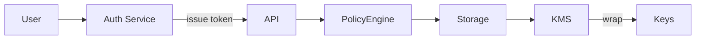

-   :material-security:{ .lg .middle } **Security & Compliance**

    ---

    HIPAA-aligned controls: encryption, audit, RBAC, retention

-   :material-shield-check:{ .lg .middle } **Zero Trust**

    ---

    Per-service auth, token scopes, and mTLS options

-   :material-history:{ .lg .middle } **Audit & Evidence**

    ---

    Logs and retention policies for compliance evidence

!!! tip 'Least privilege'
    Grant minimal roles to service accounts and human users. Prefer short-lived tokens and role-scoped credentials.

!!! note 'Encryption standards'
    - At rest: AES-256 (envelope encryption)
    - In transit: TLS 1.2+ with strong ciphers

!!! danger 'PHI exposure'
    Never write PHI to public or debug logs. Use structured logging with explicit masked fields.

## Security controls

| Control | Description | Status | HIPAA |
|---------|-------------|--------|-------|
| Encryption (rest) | AES-256 envelope | ✅ | Compliant |
| Encryption (transit) | TLS 1.2+ | ✅ | Compliant |
| RBAC | Role-based access control | ✅ | Compliant |
| Audit logs | 7-year retention | ✅ | Compliant |

## Key practices

- Rotate KMS keys regularly
- Use centralized secrets management for service tokens
- Encrypt backups and restrict access

### Incident response checklist

- [x] Revoke compromised tokens
- [x] Rotate keys where feasible
- [x] Preserve and secure audit logs
- [ ] Notify compliance officer if PHI implicated

## Policy & configuration table

| Policy | Purpose | Required | Notes |
|--------|---------|----------|-------|
| DATA_RETENTION_YEARS | How long PHI is stored | 7 | Regulatory baseline |
| AUDIT_RETENTION_YEARS | How long audit logs are kept | 7 | Evidence for compliance |
| ACCESS_APPROVAL | Manual approval for plugin PHI access | yes | For production |

!!! warning 'Audit integrity'
    Ensure timestamps and actor identity cannot be tampered with. Use signed audit entries and append-only stores.

??? note 'Third-party integrations'
    Vet third-party services for HIPAA Business Associate Agreement (BAA) before sending PHI.

[^1]: Security policies are enforced across gateway, API, storage, and messaging layers.
