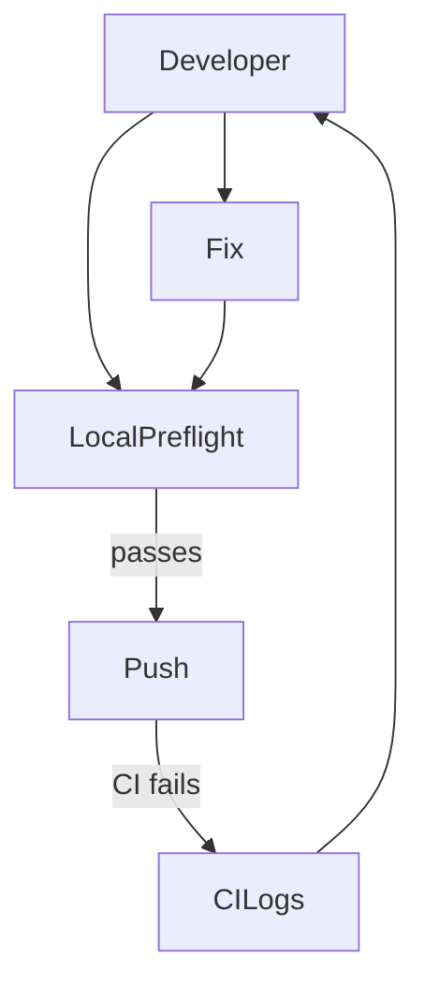

<div class='grid cards' markdown>

-   :material-alert-circle:{ .lg .middle } **Troubleshooting**

    ---

    Quick resolutions for common developer and operator issues

-   :material-bug-report:{ .lg .middle } **Common Pitfalls**

    ---

    Mypy, flake8, black, and SQLAlchemy typer pitfalls

-   :material-help:{ .lg .middle } **Debugging Playbook**

    ---

    Step-by-step checks for CI parity and UI issues

</div>

!!! tip 'Start local parity'
    When CI fails, always run the Local CI Parity preflight from getting-started before filing issues.

!!! note 'Common errors'
    The most frequent root causes are typing mistakes, mutable defaults, and import-time side effects.

!!! warning 'UI missing files'
    If the Admin UI references components not committed, tsc --noEmit will typically catch missing imports; add UI coverage to pre-push hooks.

## Quick fixes table

| Symptom | Likely cause | Quick fix |
|---------|--------------|----------|
| mypy errors about Optional | Missing explicit Optional[T] | Use T | None or Optional[T] |
| Tests failing intermittently | Async session misuse | Use async_sessionmaker and async with |
| Black/flake8 failures | Formatting/lint issues | Run black core/ and flake8 core/ |

### Debugging workflow



### Example: run the full local parity

=== "Python"
    ```python
    # (1)
    # Run all checks programmatically (simple wrapper)
    import subprocess
    subprocess.run(['bash', '-c', 'python3.11 -m venv .venv && . .venv/bin/activate && pip install -r core/requirements.txt'])
    ```

=== "Node.js"
    ```javascript
    // (1)
    // Trigger UI build for local parity
    // (cd core/admin_ui && npm ci && npm run build)
    ```

=== "curl"
    ```bash
    # (1)
    python3.11 -m venv .venv && . .venv/bin/activate
    pip install -r core/requirements.txt \
      black==25.9.0 flake8==7.3.0 mypy==1.18.2 sqlalchemy==2.0.23 \
      pytest pytest-cov pytest-asyncio
    black --check core/ || (echo 'Run: black core/' && exit 1)
    flake8 core/
    mypy --config-file mypy.ini core/
    PYTHONPATH=$PWD pytest -q
    ```

1. Run exact tool versions locally

## Error catalogue and remedies

| Error | Explanation | Remedy |
|-------|-------------|--------|
| Type error implicit Optional | Parameter default None not annotated | Annotate as T | None |
| Mutable default list | Using = [] in dataclass | Use field(default_factory=list) |
| Import side effects | DB/network calls at import | Lazy-init or fixtures in tests |

!!! note 'Async tests'
    Remember to install pytest-asyncio and mark async tests with ++@pytest.mark.asyncio++.

??? note 'When to escalate'
    If you see infrastructure-level failures (KMS, DB), collect logs, audit entries, and environment details before contacting platform SRE.

[^1]: Keeping local parity in sync with CI prevents the majority of failed pushes.
